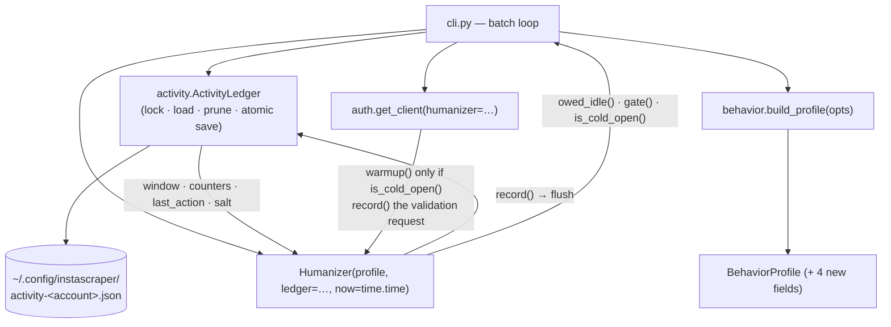
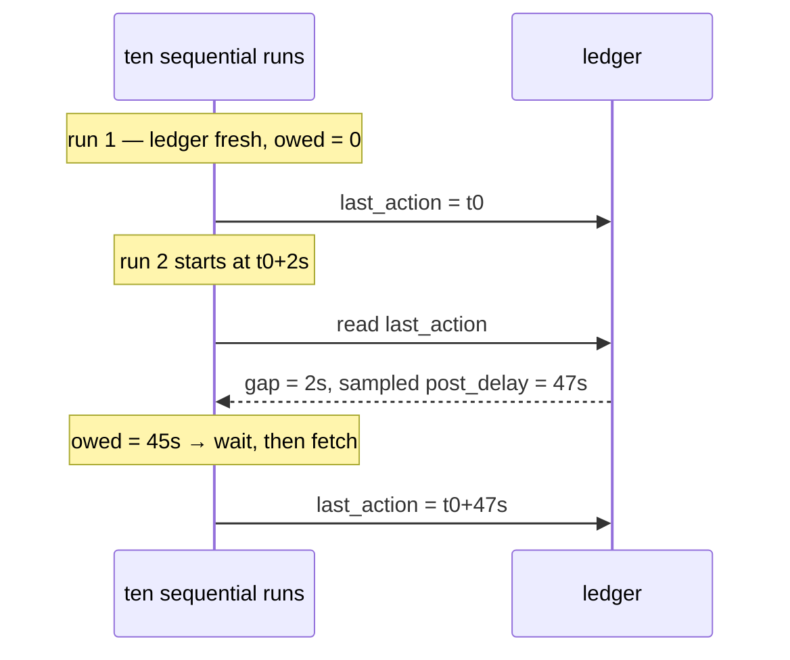
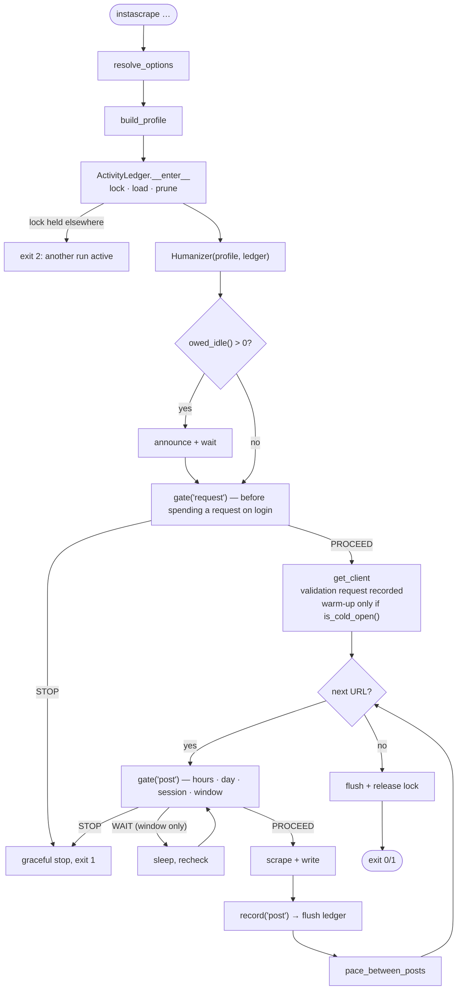

# Architecture: Cross-Session Humanization

> Read `proposal.md` (what & why) and `domain.md` (vocabulary) first.

## Overview

One new module, `instascraper/activity.py`, owns **persistence**: the
`ActivityLedger`, a small mutable document rewritten atomically. `behavior.py` keeps
owning **policy** — it gains a ledger-shaped input and an `owed_idle()` computation,
but no file I/O of its own. That split is what keeps `BehaviorProfile` pure data and
the `Humanizer` testable with an injected clock.

(`activity.py` gains a second collaborator, the append-only `PacingLog`, in
`specs/changes/pacing-log/` — same directory and account key, opposite write
discipline, and nothing here depends on it.)



| File | Change |
|------|--------|
| `activity.py` *(new)* | `ActivityLedger` — `open()/load()/flush()/close()`, schema + versioning, pruning, atomic write, `flock`, and `activity_path()`. The only file-touching code. |
| `behavior.py` | `now` default → `time.time`; window holds epoch seconds; `Humanizer(…, ledger=None)` seeds counters/window/salt from the ledger; new `owed_idle()`, `is_cold_open()`; `gate()` also checks day ceilings; edge shift derived from `(salt, local date)`; `record()` flushes. |
| `auth.py` | `warmup()` call sites (`auth.py:238, 262, 289`) become conditional on `humanizer.is_cold_open()`. The session-validation `get_timeline_feed` (`auth.py:236`) is `record()`ed — it is the run's first request. |
| `cli.py` | Open/lock the ledger and build the `Humanizer` **before `get_client`**; pay `owed_idle()` before the first request of any kind (and close the gap at `cli.py:552`); flush + release on every exit path; new flags. |
| `config.py` | `ENV_KEYS` entries for each new parameter. |
| `models.py` | Provenance notes whether cross-session state was in use. |
| `README.md`, `specs/system/*` | Document the ledger, the day ceilings, and the reset. |

## Key decisions

### 1. Persistence lives in `activity.py`, policy stays in `behavior.py`

`behavior.py` is currently pure: no I/O, everything injected, which is why its 47
tests run in 0.16 s and never sleep. Putting file handling in there would spoil
that. So `ActivityLedger` is a separate collaborator the `Humanizer` *reads from
and writes to* through a tiny interface, and which tests substitute with an
in-memory instance pointed at `tmp_path`.

```python
# activity.py
LEDGER_VERSION = 1

@dataclass
class Activity:
    """Everything persisted. Timestamps are UTC epoch seconds."""
    version: int = LEDGER_VERSION
    salt: str = ""                      # per-account, generated once
    last_action: float = 0.0
    session_started_at: float = 0.0
    session_requests: int = 0
    session_posts: int = 0
    day: str = ""                       # local ISO date, for the day counters
    day_requests: int = 0
    day_posts: int = 0
    window: list[float] = field(default_factory=list)   # request epochs

class ActivityLedger:
    def __init__(self, path, now=time.time, enabled=True): ...
    def __enter__(self): ...   # acquire flock, load, prune  -> Activity
    def __exit__(self, *exc): ...  # flush, release
    def flush(self) -> None: ...   # atomic: temp + os.replace, chmod 600
```

A **disabled** ledger (`--no-activity-ledger`) is a null object: it returns a fresh
`Activity`, never touches disk, never locks. That keeps the call sites branch-free
and gives the escape hatch for free.

**`--no-humanize` does *not* disable the ledger.** The two flags mean two different
things, and each means exactly one:

| Flag | Turns off |
|---|---|
| `--no-humanize` | **waiting and gating** — no think-time, no owed idle, no ceilings |
| `--no-activity-ledger` | **the file** — nothing is read or written |

Accounting is not pacing. An unhumanized run still calls `record()`, so
`last_action`, the counters, and the window stay true. The alternative — the earlier
draft's "humanization off ⇒ ledger off" — does not leave the ledger *empty*, it
leaves it **stating something false**, and the pacing then acts on the falsehood:

```
09:00  humanized batch of 40           → ledger: day_posts=40, last_action=09:xx
14:00  --no-humanize, 60 posts unpaced → ledger untouched
14:20  humanized run                   → reads day_posts=40 (really 100: the day
                                          ceiling cannot bind) and a 5-hour gap, so
                                          it declares a cold open, warms up, and
                                          owes zero idle — twenty minutes after an
                                          unpaced 60-post burst
```

`domain.md`'s rule is that a bad ledger degrades to today's behavior *with a
warning*. A confident wrong answer is not degradation. So: pacing off, accounting on
— and `--no-humanize --no-activity-ledger` together reproduce the pre-humanization
tool exactly, for anyone who wants no file at all.

Note the consequence for the profile: `owed_idle()` and `gate()` keep their
`if not profile.enabled: return` short-circuits, but `record()` loses its — it is now
unconditional.

### 2. Wall clock, not monotonic — and handle the consequences

`behavior.py:122` defaults `now=time.monotonic`, and `record()` appends
`self._now()` to the window (`behavior.py:192`). Monotonic values are meaningless
in another process, so the window cannot be persisted as-is. The window and every
persisted timestamp move to **UTC epoch seconds** (`time.time`).

What monotonic was protecting against has to be handled explicitly instead:

- **Clock moved backwards** (`now < last_action`): treat the gap as `0` — continue
  the session, owe no idle. Never compute a negative gap into a wait.
- **Absurd future `last_action`** (more than `window_seconds` ahead): the ledger is
  untrustworthy; warn and start fresh rather than idling for hours.
- **Window entries in the future**: dropped during pruning.

Rationale: at an hour scale, cross-process meaning is worth more than immunity to
NTP nudges, and the failure modes above are cheap to name and test. `now` stays
injected, so tests still drive it exactly.

### 3. `session` = activity session, defined by an idle gap

```python
# behavior.py — new profile fields
session_idle_reset: float = 1800.0    # 30 min; gap that starts a new session
foreground_idle: float = 300.0        # 5 min; gap after which the app wasn't open
max_requests_per_day: int = 1000
max_posts_per_day: int = 150
```

**Two thresholds, because there are two questions.** On construction the
`Humanizer` measures the gap once — `now - activity.last_action` — and reads it
twice:

| Question | Threshold | Answered by | Effect |
|---|---|---|---|
| Is this the same *sitting* — does the session budget carry over? | `session_idle_reset` (30 min) | `is_new_session()` | zero `session_requests`/`session_posts`, set `session_started_at = now` |
| Was the app plausibly still *in the foreground*? | `foreground_idle` (5 min) | `is_cold_open()` | warm-up fires |

Collapsing these into one number, as an earlier draft did, means a 26-minute gap
counts as a continuation and skips warm-up — modelling someone who stared at
Instagram for 26 minutes without touching it. A locked screen or an OS that swapped
the app out is a *much* shorter horizon than a sitting, and a phone locks in under a
minute. Two questions, two fields.

Because `foreground_idle ≤ session_idle_reset` (an invariant `build_profile`
validates, warning and raising `foreground_idle` to the reset if a config inverts
them), **a new activity session is always also a cold open** — the converse does not
hold, and that asymmetry is the point.

`gate()` (`behavior.py:194`) gains the day checks alongside the existing session
and window ones. Order matters, cheapest and most-final first: active hours →
day ceilings → session ceilings → rolling window. Day and session ceilings return
`STOP` (consistent with `specs/system/architecture.md` "Pacing": only the rolling window
ever yields a bounded `WAIT`).

### 4. Owed idle closes the actual hole — and it is paid before login

The measured bug is that `cli.py:552` skips pacing for the last (and therefore
the only) post. The fix is symmetric: pace *before* the first post too, but only
for the time not already elapsed.

```python
def sample_delay(self, kind: str = "request") -> float:
    """The think-time for `kind`, sampled but *not* slept."""
    # …the body of today's delay(), minus the sleep…

def delay(self, kind: str = "request") -> float:
    seconds = self.sample_delay(kind)
    self._sleep(seconds)
    return seconds

def owed_idle(self) -> float:
    """Seconds still to wait before this run's first request."""
    if not self.profile.enabled:
        return 0.0
    if self._activity.last_action <= 0.0:
        return 0.0                       # nothing to continue from
    gap = max(0.0, self._now() - self._activity.last_action)
    return max(0.0, self.sample_delay("post") - gap)
```

**Owed idle samples the *same distribution* as the pace it stands in for**, which is
why `delay()` splits into a pure `sample_delay()` plus a sleep. The gap it replaces
is `pace_between_posts` → `delay("post")` (`cli.py:398`), and that is not
`post_delay`: `behavior.py:156-157` adds a `long_pause` on top with probability
`long_pause_prob`. Sampling bare `post_delay` here would make the multi-invocation
path average ~55 s against the batch path's ~70 s at the defaults, and — worse —
would **never produce the long tail at all**. `behavior.py:155` calls that tail "the
tail an even drip never produces"; a loop-driven user would get the even drip. One
sampler, one distribution, both paths.

`cli.main` pays it once, announcing it via `progress.stage` so it never looks like
a hang — and it pays it **before `get_client`**, not after.

That ordering is the whole point, and it is not a detail. `auth.py:236` validates
a reused session with `client.get_timeline_feed()`: a real private-API request,
fired before warm-up and recorded nowhere. Paying owed idle after login would put
the run's *first packet* 2 s after the previous run's last one and only then
idle — the idle would be real but unobserved, which is the same as not having it.
So:

- **`owed_idle()` is paid before `get_client`.** `cli.main` builds the ledger and
  the `Humanizer` first, pays, then authenticates.
- **The validation request is recorded.** `auth.get_client` calls
  `humanizer.record("request")` after `get_timeline_feed()` succeeds, so it lands
  in the window and the session/day counters like any other request. It is
  currently the one request in the tool that no counter sees.
- **It is gated too.** A `gate("request")` before login means a day ceiling stops
  the run *before* spending a request on validating a session we are not going to
  use — otherwise every invocation after a day cap still costs one real call, and
  the "budget" leaks one request per invocation forever.

**Consequence — the ledger opens before the account is known.** Today the account
name comes *out* of `get_client` (`cli.py:467`). The ledger path cannot wait for
it, so it is keyed on the configured username with exactly the fallback
`auth._settings_path` (`auth.py:123-127`) already uses for the session file:

```python
# activity.py
def activity_path(username: str | None, override: str | None = None) -> Path:
    if override:
        return Path(override)
    name = f"activity-{username}.json" if username else "activity.json"
    return DEFAULT_SESSION_DIR / name
```

`username` is `opts["username"]` or `IG_USERNAME` — the same resolution
`get_client` performs (`auth.py:214`). A `--browser` bootstrap with no configured
username shares the unkeyed `activity.json`, which is correct: it is one person on
one machine, and the session file has behaved that way since before this change.
Re-keying the ledger after login is **rejected** — it would mean pacing decisions
taken against one file and recorded to another.



Net effect: the ten-run and one-batch cases converge, which is the test to write.

### 5. Derived daily edges instead of per-run draws

`behavior.py:135-136` draws two edge shifts per `Humanizer`. Across many runs that
re-randomizes the boundary every invocation. Replace with a value derived from the
ledger salt and the local date:

```python
def _edge_shift(self, which: str) -> float:
    digest = hashlib.sha256(f"{salt}:{local_date}:{which}".encode()).digest()
    frac = int.from_bytes(digest[:8], "big") / 2**64          # [0,1)
    magnitude = self.profile.active_hours_jitter.lo + frac * (
        self.profile.active_hours_jitter.hi - self.profile.active_hours_jitter.lo
    )
    return (1.0 if digest[8] & 1 else -1.0) * magnitude / 60.0
```

Deterministic given `(salt, date)`, so stable all day and different tomorrow, and
trivially testable without touching the RNG. With no ledger (disabled) it falls
back to today's RNG draw — behavior-preserving.

### 6. One run at a time, via `flock`

The ledger is opened with an exclusive `fcntl.flock(..., LOCK_EX | LOCK_NB)`.

- **Acquired** → proceed; the OS releases it on exit *including a crash*, which a
  hand-rolled pidfile would not.
- **Held by another run** → retry for `lock_timeout` (default 5 s), then exit
  `EXIT_FATAL` with "another instascrape is running for @user; ledgers would
  conflict. Wait for it to finish."

This is both the correctness fix for concurrent writes and the right behavior:
a person has one phone. Rejected alternative: merging concurrent updates — more
code, and it would legitimize a pattern we do not want.

`flock` is POSIX; macOS and Linux are the supported platforms (`darwin` per the
repo). On a platform without it, the ledger degrades to unlocked atomic writes
with a warning rather than failing.

### 7. Flush cadence: after every recorded post

Flushing once at exit loses everything if the process is killed mid-batch — and a
killed batch is exactly when the state matters. Flushing on every `record()` is
one small `os.replace` per request, which is cheap next to a multi-second paced
HTTP call. Compromise, and it is the safe one: **flush after every recorded post**
(and once at exit), so a crash loses at most one post's worth of budget.

### 8. Configuration: the existing precedence chain

Same shape as the existing option handling — every parameter gets an `ENV_KEYS`
entry and a CLI flag resolved by `_pick` (**CLI > .env > env var > default**), and
defaults live only in `BehaviorProfile`.

| Flag | `.env` key | Default |
|------|-----------|---------|
| `--no-activity-ledger` | `INSTASCRAPE_ACTIVITY_LEDGER` | on |
| `--activity-file PATH` | `INSTASCRAPE_ACTIVITY_FILE` | `~/.config/instascraper/activity-<account>.json` |
| `--humanize-session-idle-reset SECONDS` | `INSTASCRAPE_HUMANIZE_SESSION_IDLE_RESET` | `1800` |
| `--humanize-foreground-idle SECONDS` | `INSTASCRAPE_HUMANIZE_FOREGROUND_IDLE` | `300` |
| `--humanize-max-requests-per-day N` | `INSTASCRAPE_HUMANIZE_MAX_REQUESTS_PER_DAY` | `1000` |
| `--humanize-max-posts-per-day N` | `INSTASCRAPE_HUMANIZE_MAX_POSTS_PER_DAY` | `150` |
| `--humanize-lock-timeout SECONDS` | `INSTASCRAPE_HUMANIZE_LOCK_TIMEOUT` | `5` |

**`--no-activity-ledger` must not be persisted.** It joins `humanize` in
`cli._NEVER_SAVED` (`cli.py:410`) for exactly the reason established last change:
cross-session pacing being the default is the point, and a one-off opt-out silently
leaking into every later run would defeat it. (`specs/changes/pacing-log/` draws the
deliberate contrast: `--no-activity-log` *does* save, because it is observability,
not behavior.)

## Data / control flow (a run)



## Testing strategy

Network-free **and sleep-free**, as established (the suite is verified against a
`conftest` that raises on any real `time.sleep` or `socket.connect`).

- **Ledger round-trip**: write → read gives identical counters/window; unknown
  `version` is discarded with a warning; corrupt JSON, truncated file, missing
  file, and unreadable file all degrade to a fresh `Activity` without raising.
- **Pruning**: entries older than `window_seconds` and entries in the future are
  dropped on load.
- **Atomic write**: no partial file is ever observable — assert the temp file is
  replaced, and that a failed write leaves the previous ledger intact.
- **The headline regression test**: simulate ten one-URL runs sharing one ledger
  with a fake clock and assert they are *structurally* indistinguishable from one
  ten-URL batch — nine paced gaps rather than zero, post counter `10`, one warm-up,
  each gap inside the `post` think-time distribution. Not equality of the idle sums:
  each run reseeds by design (`proposal.md`, RNG out of scope), so that number is
  not a property of the system. This is the bug; it gets a named test.
- **Session continuity**: gap < reset keeps the counters; gap > reset zeroes them.
- **The two thresholds are independent**: a gap between `foreground_idle` and
  `session_idle_reset` (e.g. 26 min at the defaults) keeps the counters **and**
  reports a cold open — the case that motivated splitting them. A 90 s gap is
  neither; a 40 min gap is both. `foreground_idle > session_idle_reset` in config is
  corrected with a warning.
- **Owed idle**: fresh ledger → 0; recent `last_action` → the remainder; long gap
  → 0; clock moved backwards → 0, never negative.
- **Day ceilings**: rolling over local midnight resets them; hitting them returns
  `STOP`, never a multi-hour `WAIT`.
- **Stable edges**: same `(salt, date)` → identical shift across many `Humanizer`
  instances; different date → different shift.
- **Locking**: a second ledger on the same path fails to acquire and surfaces the
  clear message; the lock is released after `__exit__`.
- **Regression**: `ledger=None` / `--no-activity-ledger` reproduces the current
  `human-behavior-simulation` behavior exactly, including the RNG-drawn edges.
- **First packet ordering**: the owed idle is slept *before* the session-validation
  request, and validating a reused session advances the request counter and the
  window by exactly one.

## Rejected alternatives

- **Keep `monotonic` and store a wall-clock offset alongside it.** Rejected — two
  clocks to keep consistent, and the offset is invalidated by exactly the events
  (suspend, reboot) that matter most.
- **Persist counters inside the existing session JSON** (`session-<user>.json`).
  Rejected — that file is instagrapi's `dump_settings` format and is the *device
  identity*, which `specs/system/architecture.md` deliberately treats as
  untouchable. Mixing volatile pacing state into it risks corrupting the one thing
  that must never drift.
- **A background daemon holding state in memory.** Rejected — a whole new process
  model and lifecycle for a CLI that runs for seconds; the file is enough.
- **Merge concurrent runs' ledgers instead of locking.** Rejected — more code to
  support a pattern (two simultaneous clients for one account) that is itself the
  signal we are trying not to emit.
- **Make every invocation sleep a full `post_delay` on startup.** Rejected — it
  double-pays inside `--file` batches and punishes the first run of the day for no
  reason. Owed idle is the correct, elapsed-time-aware form.
- **Keep the history inside the ledger** (an `events: [...]` array). Rejected — it
  turns a bounded document rewritten on every post into an unbounded one, so each
  flush rewrites the entire history and a crash mid-write risks the *state* to
  preserve the *log*. Opposite write disciplines belong in opposite files, which is
  why history is `specs/changes/pacing-log/` and not a field here.
- **Pay owed idle after login.** Rejected — the session-validation
  `get_timeline_feed` (`auth.py:236`) is already a request, so the idle would be
  real but unobserved, and ten invocations would still emit ten timeline hits in
  three minutes (§4).
- **Re-key the ledger on the account returned by `get_client`.** Rejected — pacing
  decisions would be taken against one file and recorded to another. The configured
  username, with the session file's own fallback, is the key (§4).
- **Ship the pacing log in this change.** Rejected during grilling — ~40% of the
  plan for a file nothing in the tool reads, competing for review attention with
  locking, atomic writes, and the wall-clock migration. It is now
  `specs/changes/pacing-log/`, and it lands better *after* this, when its events
  exist and its byte cap can be checked against a real event rate.
