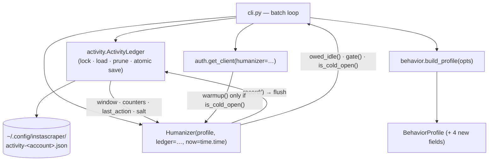
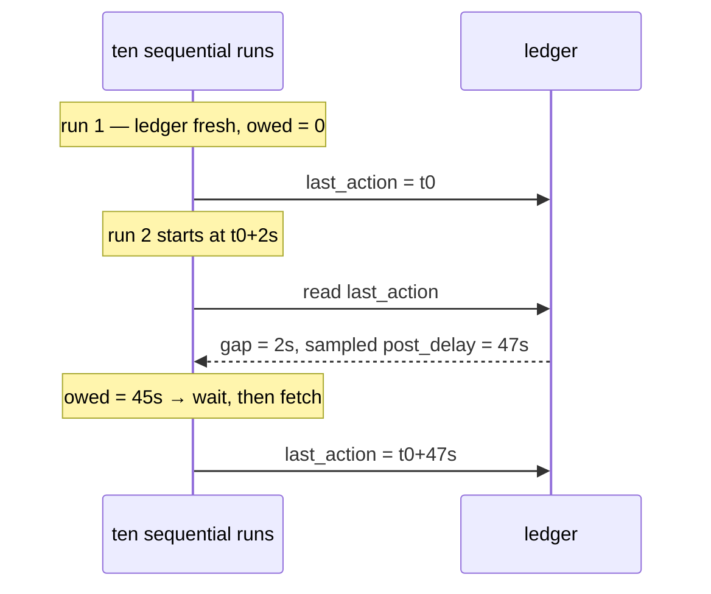
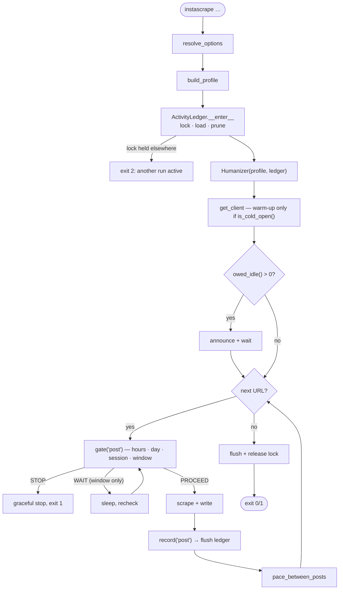

# Architecture: Cross-Session Humanization

> Read `proposal.md` (what & why) and `domain.md` (vocabulary) first.

## Overview

One new module, `instascraper/activity.py`, owns **persistence**.
`behavior.py` keeps owning **policy** — it gains a ledger-shaped input and an
`owed_idle()` computation, but no file I/O of its own. That split is what keeps
`BehaviorProfile` pure data and the `Humanizer` testable with an injected clock.



| File | Change |
|------|--------|
| `activity.py` *(new)* | `ActivityLedger` — `open()/load()/flush()/close()`, schema + versioning, pruning, atomic write, `flock`. The only file-touching code. |
| `behavior.py` | `now` default → `time.time`; window holds epoch seconds; `Humanizer(…, ledger=None)` seeds counters/window/salt from it; new `owed_idle()`, `is_cold_open()`; `gate()` also checks day ceilings; edge shift derived from `(salt, local date)`; `record()` flushes. |
| `auth.py` | `warmup()` call sites (`auth.py:233, 257, 284`) become conditional on `humanizer.is_cold_open()`. |
| `cli.py` | Open/lock the ledger; pay `owed_idle()` **before the first** post (the gap at `cli.py:552`); flush + release on every exit path; new flags. |
| `config.py` | `ENV_KEYS` entries for each new parameter. |
| `models.py` | Provenance notes whether cross-session state was in use. |
| `README.md`, `specs/system/*` | Document the ledger, the day ceilings, and the reset. |

## Key decisions

### 1. Persistence lives in `activity.py`, policy stays in `behavior.py`

`behavior.py` is currently pure: no I/O, everything injected, which is why its 47
tests run in 0.16 s and never sleep. Putting file handling in there would spoil
that. So `ActivityLedger` is a separate collaborator the `Humanizer` *reads from
and writes to* through a tiny interface, and which tests substitute with an
in-memory instance pointed at `tmp_path`.

```python
# activity.py
LEDGER_VERSION = 1

@dataclass
class Activity:
    """Everything persisted. Timestamps are UTC epoch seconds."""
    version: int = LEDGER_VERSION
    salt: str = ""                      # per-account, generated once
    last_action: float = 0.0
    session_started_at: float = 0.0
    session_requests: int = 0
    session_posts: int = 0
    day: str = ""                       # local ISO date, for the day counters
    day_requests: int = 0
    day_posts: int = 0
    window: list[float] = field(default_factory=list)   # request epochs

class ActivityLedger:
    def __init__(self, path, now=time.time, enabled=True): ...
    def __enter__(self): ...   # acquire flock, load, prune  -> Activity
    def __exit__(self, *exc): ...  # flush, release
    def flush(self) -> None: ...   # atomic: temp + os.replace, chmod 600
```

A **disabled** ledger (`--no-activity-ledger`, or humanization off) is a null
object: it returns a fresh `Activity`, never touches disk, never locks. That keeps
the call sites branch-free and gives the escape hatch for free.

### 2. Wall clock, not monotonic — and handle the consequences

`behavior.py:122` defaults `now=time.monotonic`, and `record()` appends
`self._now()` to the window (`behavior.py:192`). Monotonic values are meaningless
in another process, so the window cannot be persisted as-is. The window and every
persisted timestamp move to **UTC epoch seconds** (`time.time`).

What monotonic was protecting against has to be handled explicitly instead:

- **Clock moved backwards** (`now < last_action`): treat the gap as `0` — continue
  the session, owe no idle. Never compute a negative gap into a wait.
- **Absurd future `last_action`** (more than `window_seconds` ahead): the ledger is
  untrustworthy; warn and start fresh rather than idling for hours.
- **Window entries in the future**: dropped during pruning.

Rationale: at an hour scale, cross-process meaning is worth more than immunity to
NTP nudges, and the failure modes above are cheap to name and test. `now` stays
injected, so tests still drive it exactly.

### 3. `session` = activity session, defined by an idle gap

```python
# behavior.py — new profile fields
session_idle_reset: float = 1800.0    # 30 min; gap that starts a new session
max_requests_per_day: int = 1000
max_posts_per_day: int = 150
```

On construction the `Humanizer` compares `now - activity.last_action` to
`session_idle_reset`:

- **gap > reset** → cold open: zero `session_requests`/`session_posts`, set
  `session_started_at = now`, allow warm-up.
- **gap ≤ reset** → continuation: keep the session counters, skip warm-up.

`gate()` (`behavior.py:194`) gains the day checks alongside the existing session
and window ones. Order matters, cheapest and most-final first: active hours →
day ceilings → session ceilings → rolling window. Day and session ceilings return
`STOP` (consistent with `specs/system/architecture.md` "Pacing": only the rolling window
ever yields a bounded `WAIT`).

### 4. Owed idle closes the actual hole

The measured bug is that `cli.py:552` skips pacing for the last (and therefore
the only) post. The fix is symmetric: pace *before* the first post too, but only
for the time not already elapsed.

```python
def owed_idle(self) -> float:
    """Seconds still to wait before the first fetch of this run."""
    if not self.profile.enabled:
        return 0.0
    gap = max(0.0, self._now() - self._activity.last_action)
    if self._activity.last_action <= 0.0:
        return 0.0                       # nothing to continue from
    return max(0.0, self.profile.post_delay.sample(self._rng) - gap)
```

`cli.main` pays it once, after login and before the loop, announcing it via
`progress.stage` so it never looks like a hang.



Net effect: the ten-run and one-batch cases converge, which is the test to write.

### 5. Derived daily edges instead of per-run draws

`behavior.py:135-136` draws two edge shifts per `Humanizer`. Across many runs that
re-randomizes the boundary every invocation. Replace with a value derived from the
ledger salt and the local date:

```python
def _edge_shift(self, which: str) -> float:
    digest = hashlib.sha256(f"{salt}:{local_date}:{which}".encode()).digest()
    frac = int.from_bytes(digest[:8], "big") / 2**64          # [0,1)
    magnitude = self.profile.active_hours_jitter.lo + frac * (
        self.profile.active_hours_jitter.hi - self.profile.active_hours_jitter.lo
    )
    return (1.0 if digest[8] & 1 else -1.0) * magnitude / 60.0
```

Deterministic given `(salt, date)`, so stable all day and different tomorrow, and
trivially testable without touching the RNG. With no ledger (disabled) it falls
back to today's RNG draw — behavior-preserving.

### 6. One run at a time, via `flock`

The ledger is opened with an exclusive `fcntl.flock(..., LOCK_EX | LOCK_NB)`.

- **Acquired** → proceed; the OS releases it on exit *including a crash*, which a
  hand-rolled pidfile would not.
- **Held by another run** → retry for `lock_timeout` (default 5 s), then exit
  `EXIT_FATAL` with "another instascrape is running for @user; ledgers would
  conflict. Wait for it to finish."

This is both the correctness fix for concurrent writes and the right behavior:
a person has one phone. Rejected alternative: merging concurrent updates — more
code, and it would legitimize a pattern we do not want.

`flock` is POSIX; macOS and Linux are the supported platforms (`darwin` per the
repo). On a platform without it, the ledger degrades to unlocked atomic writes
with a warning rather than failing.

### 7. Flush cadence: after every recorded post

Flushing once at exit loses everything if the process is killed mid-batch — and a
killed batch is exactly when the state matters. Flushing on every `record()` is
one small `os.replace` per request, which is cheap next to a multi-second paced
HTTP call. Compromise, and it is the safe one: **flush after every recorded post**
(and once at exit), so a crash loses at most one post's worth of budget.

### 8. Configuration: the existing precedence chain

Same shape as the existing option handling — every parameter gets an `ENV_KEYS`
entry and a CLI flag resolved by `_pick` (**CLI > .env > env var > default**), and
defaults live only in `BehaviorProfile`.

| Flag | `.env` key | Default |
|------|-----------|---------|
| `--no-activity-ledger` | `INSTASCRAPE_ACTIVITY_LEDGER` | on |
| `--activity-file PATH` | `INSTASCRAPE_ACTIVITY_FILE` | `~/.config/instascraper/activity-<account>.json` |
| `--humanize-session-idle-reset SECONDS` | `INSTASCRAPE_HUMANIZE_SESSION_IDLE_RESET` | `1800` |
| `--humanize-max-requests-per-day N` | `INSTASCRAPE_HUMANIZE_MAX_REQUESTS_PER_DAY` | `1000` |
| `--humanize-max-posts-per-day N` | `INSTASCRAPE_HUMANIZE_MAX_POSTS_PER_DAY` | `150` |
| `--humanize-lock-timeout SECONDS` | `INSTASCRAPE_HUMANIZE_LOCK_TIMEOUT` | `5` |

**`--no-activity-ledger` must not be persisted.** It joins `humanize` in
`cli._NEVER_SAVED` (`cli.py:410`) for exactly the reason established last change:
cross-session pacing being the default is the point, and a one-off opt-out silently
leaking into every later run would defeat it.

## Data / control flow (a run)



## Testing strategy

Network-free **and sleep-free**, as established (the suite is verified against a
`conftest` that raises on any real `time.sleep` or `socket.connect`).

- **Ledger round-trip**: write → read gives identical counters/window; unknown
  `version` is discarded with a warning; corrupt JSON, truncated file, missing
  file, and unreadable file all degrade to a fresh `Activity` without raising.
- **Pruning**: entries older than `window_seconds` and entries in the future are
  dropped on load.
- **Atomic write**: no partial file is ever observable — assert the temp file is
  replaced, and that a failed write leaves the previous ledger intact.
- **The headline regression test**: simulate ten one-URL runs sharing one ledger
  with a fake clock and assert the total idle and the post counters match one
  ten-URL batch. This is the bug; it gets a named test.
- **Session continuity**: gap < reset keeps counters and reports *not* a cold open;
  gap > reset zeroes them and reports a cold open.
- **Owed idle**: fresh ledger → 0; recent `last_action` → the remainder; long gap
  → 0; clock moved backwards → 0, never negative.
- **Day ceilings**: rolling over local midnight resets them; hitting them returns
  `STOP`, never a multi-hour `WAIT`.
- **Stable edges**: same `(salt, date)` → identical shift across many `Humanizer`
  instances; different date → different shift.
- **Locking**: a second ledger on the same path fails to acquire and surfaces the
  clear message; the lock is released after `__exit__`.
- **Regression**: `ledger=None` / `--no-activity-ledger` reproduces the current
  `human-behavior-simulation` behavior exactly, including the RNG-drawn edges.

## Rejected alternatives

- **Keep `monotonic` and store a wall-clock offset alongside it.** Rejected — two
  clocks to keep consistent, and the offset is invalidated by exactly the events
  (suspend, reboot) that matter most.
- **Persist counters inside the existing session JSON** (`session-<user>.json`).
  Rejected — that file is instagrapi's `dump_settings` format and is the *device
  identity*, which `specs/system/architecture.md` deliberately treats as
  untouchable. Mixing volatile pacing state into it risks corrupting the one thing
  that must never drift.
- **A background daemon holding state in memory.** Rejected — a whole new process
  model and lifecycle for a CLI that runs for seconds; the file is enough.
- **Merge concurrent runs' ledgers instead of locking.** Rejected — more code to
  support a pattern (two simultaneous clients for one account) that is itself the
  signal we are trying not to emit.
- **Make every invocation sleep a full `post_delay` on startup.** Rejected — it
  double-pays inside `--file` batches and punishes the first run of the day for no
  reason. Owed idle is the correct, elapsed-time-aware form.
