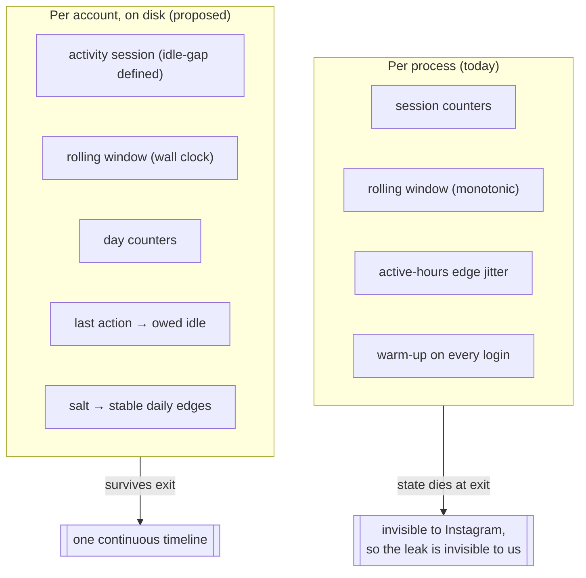
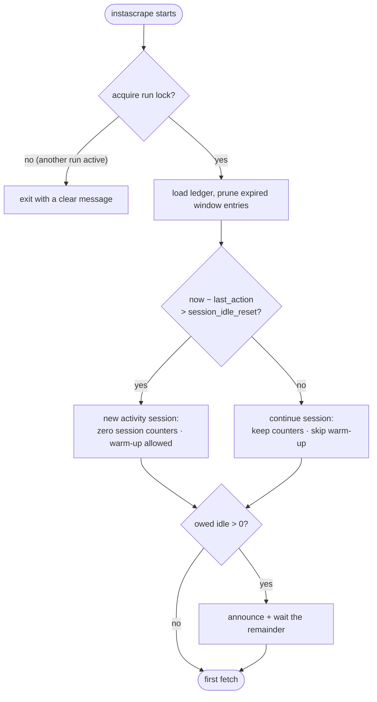
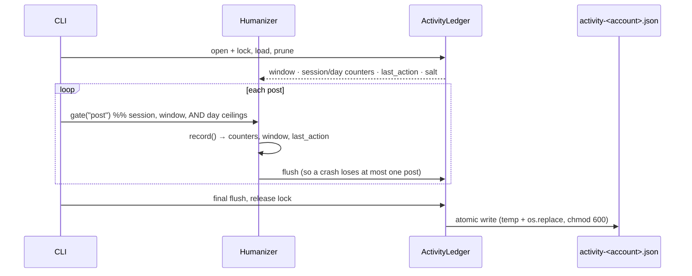

# Domain: Cross-Session Humanization

New and refined vocabulary. Extends `specs/system/domain.md`, whose glossary
already carries the humanization terms from the archived
`human-behavior-simulation` change — existing terms (Behavior profile, Humanizer,
Think-time, Rate ceiling, Gate result) keep their meaning except where noted
under **Refined terms**.

## The shift: process time → account time

Today every pacing question is answered inside one process. This change moves the
answers onto a timeline that belongs to the *account*.

## Glossary

| Term | Meaning |
|------|---------|
| **Activity ledger** | The small JSON document persisting pacing state for one account at `~/.config/instascraper/activity-<account>.json` (chmod 600). Holds **only** timestamps, counters, and a salt — no URLs, shortcodes, captions, or comments. Deleting it is a full reset. |
| **Activity session** | A run of activity with no gap longer than the **session idle reset**. Replaces "one process" as the meaning of *session* in `max_*_per_session`. Two invocations 10 s apart are one activity session; 40 min apart are two. |
| **Session idle reset** | The gap (default 30 min) after which the next action starts a new activity session and zeroes the session counters. The human reading: how long you put the phone down before picking it up counts as a fresh sitting. |
| **Last action** | The wall-clock timestamp of the most recent recorded request or post. The anchor for **owed idle** and for the new-session decision. |
| **Owed idle** | The wait a run performs *before its first fetch*: `sampled post_delay − (now − last action)`, floored at zero. What makes ten sequential one-URL runs pace like one ten-URL batch. Zero when the ledger is fresh or the gap is already long enough. |
| **Day counters** | Requests and posts recorded so far in the current **local** day, enabling `max_requests_per_day` / `max_posts_per_day` — ceilings that are meaningless without persistence. Roll over at local midnight, not at a fixed 24 h offset. |
| **Ledger salt** | A random per-account value generated once and stored in the ledger. Combined with the local date it derives the **active-hours edge shift**, so the boundary is stable for a day and different tomorrow. |
| **Stable daily edge** | The active-hours boundary derived from `(salt, local date)` instead of drawn per `Humanizer`. Same shifted boundary all day (a person whose bedtime is 23:14 today), rather than a fresh offset every invocation. |
| **Run lock** | An OS-level advisory exclusive lock (`flock`) held on the ledger for the duration of a run. Serializes ledger writes *and* enforces the behavioral fact that a person uses one phone at a time. |
| **Cold open** | A genuinely new activity session, and the only situation in which **warm-up** should fire. Mid-session invocations skip warm-up — ten cold opens in three minutes is itself the signal. |

## Refined terms

| Term | Was | Becomes |
|------|-----|---------|
| **Session** (in `max_requests_per_session`, `max_posts_per_session`) | One `instascrape` process | One **activity session** — bounded by `session_idle_reset`, spanning as many invocations as fit inside it |
| **Rolling window** | A `deque` of `time.monotonic()` values, empty at startup | A `deque` of **UTC epoch** values, loaded from the ledger and pruned on load |
| **Warm-up** | Fires on every session load / login | Fires only on a **cold open** |
| **Active-hours edge jitter** | Two shifts drawn per `Humanizer` from the RNG | One shift derived from `(ledger salt, local date)` |

## Processes

### Deciding what a run owes before it starts

### Recording, and surviving the exit

## Actors & key rules

- **The account, not the process, is the unit of pacing.** Any ceiling or idle
  named "per session" must mean something an observer on Instagram's side could
  also measure. A process boundary is invisible on the wire, so it must not be
  visible in our pacing either.
- **State is a convenience, never a dependency.** A missing, corrupt, truncated,
  or future-dated ledger degrades to today's behavior with a warning. It must
  never fail a run, and never wait absurdly.
- **The ledger records pacing, not activity history.** Timestamps and counts only.
  It must not become a log of what the user archived — that data already lives in
  the output folders, and duplicating it here would be a privacy regression.
- **Identity stays stable, behavior stays varied** (unchanged from
  `human-behavior-simulation`) — and now the *daily* rhythm is stable too. The
  edge jitter is derived, not re-drawn, because a boundary that moves every few
  minutes is noise, not a person.
- **Waiting must be visible.** A run that idles before doing anything looks like a
  hang. It announces what it is waiting for and why, and can be opted out of.
- **Honest limits.** Cross-session continuity closes a real hole in the previous
  change. It does not make the tool undetectable, and the docs must keep saying so.
