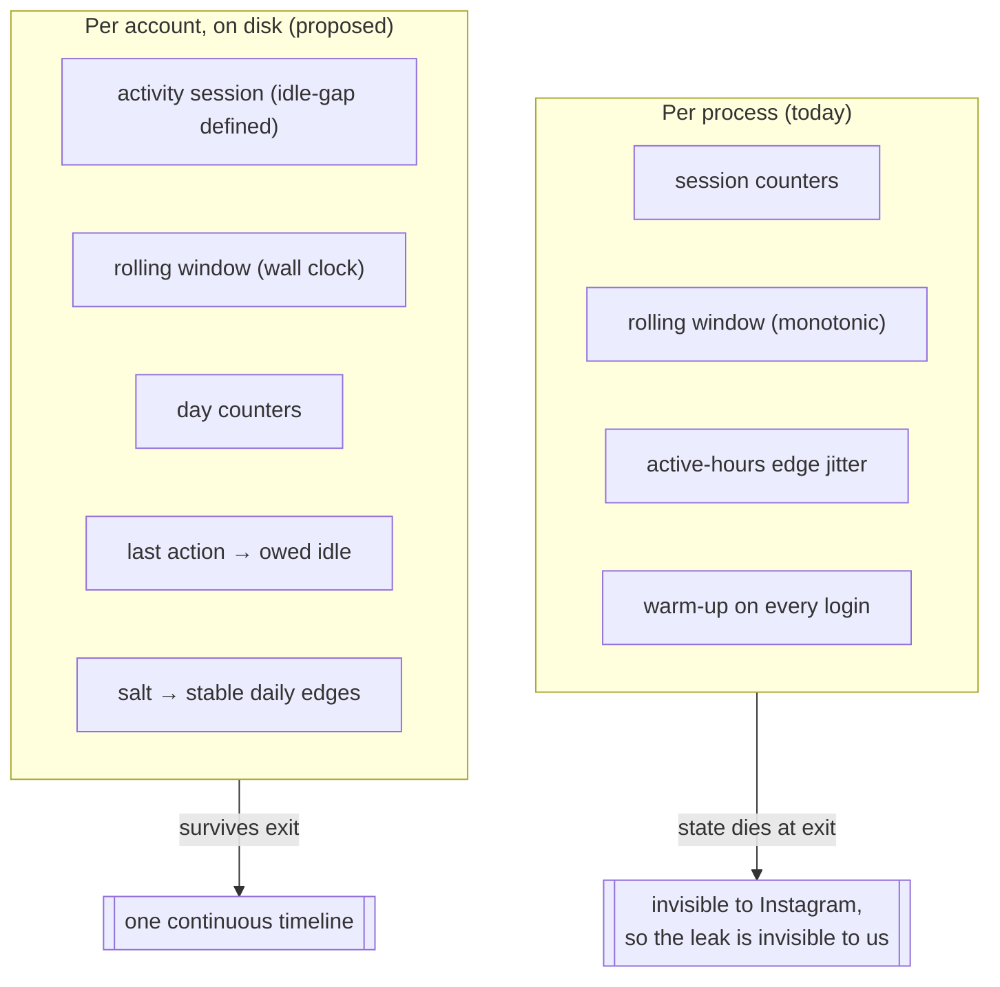
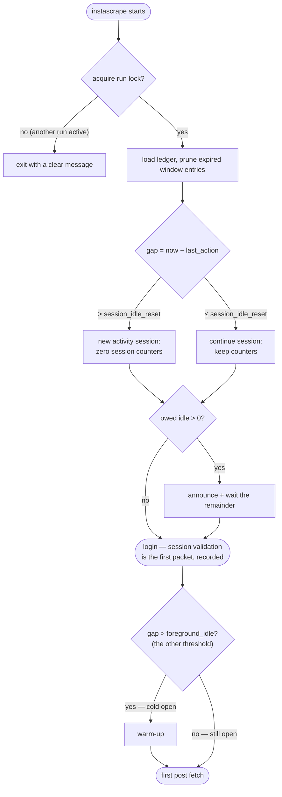
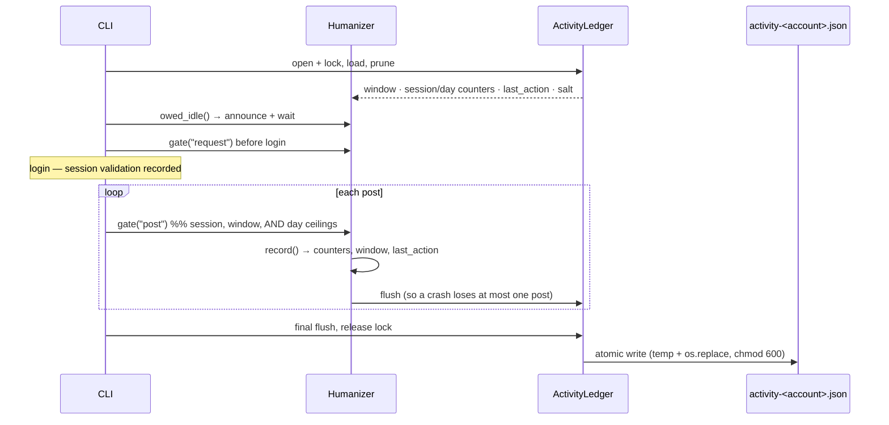

# Domain: Cross-Session Humanization

New and refined vocabulary. Extends `specs/system/domain.md`, whose glossary
already carries the humanization terms from the archived
`human-behavior-simulation` change — existing terms (Behavior profile, Humanizer,
Think-time, Rate ceiling, Gate result) keep their meaning except where noted
under **Refined terms**.

## The shift: process time → account time

Today every pacing question is answered inside one process. This change moves the
answers onto a timeline that belongs to the *account*.

## Glossary

| Term | Meaning |
|------|---------|
| **Activity ledger** | The small JSON document persisting pacing state for one account at `~/.config/instascraper/activity-<account>.json` (chmod 600). Holds **only** timestamps, counters, and a salt — no URLs, shortcodes, captions, or comments. Deleting it is a full reset. |
| **Activity session** | A run of activity with no gap longer than the **session idle reset**. Replaces "one process" as the meaning of *session* in `max_*_per_session`. Two invocations 10 s apart are one activity session; 40 min apart are two. |
| **Session idle reset** | The gap (default 30 min) after which the next action starts a new activity session and zeroes the session counters — **the budget question only**. The human reading: how long you put the phone down before picking it up counts as a fresh sitting. |
| **Foreground idle** | The much shorter gap (default 5 min) after which the app can no longer plausibly have been in the foreground — the screen locked, iOS swapped it out — so the next run is a **cold open** and warms up. Answers a different question from **session idle reset** and therefore is a different number: "was the app still open?", not "is this the same sitting?". Necessarily `foreground_idle ≤ session_idle_reset`, so a new activity session is always also a cold open. |
| **Last action** | The wall-clock timestamp of the most recent recorded request or post. The anchor for **owed idle** and for the new-session decision. |
| **Owed idle** | The wait a run performs *before its first request of any kind* — including the session-validation one inside login: `sampled post think-time − (now − last action)`, floored at zero. Drawn from the **same distribution as the inter-post pace**, long-pause tail included, since it stands in for exactly that gap. What makes ten sequential one-URL runs pace like one ten-URL batch. Zero when the ledger is fresh or the gap is already long enough. |
| **Session validation** | The `get_timeline_feed` a reused session is proved alive with. Not a free health check but the run's **first request** — paced, counted, and gated like any other, since an observer cannot tell it apart from a fetch. |
| **First packet** | The boundary the paced timeline starts at: the first byte this invocation puts on the wire, whatever its purpose. Distinguished from the first *post* fetch, which is what an earlier draft of this change paced from and which is invisible to Instagram as a boundary. |
| **Day counters** | Requests and posts recorded so far in the current **local** day, enabling `max_requests_per_day` / `max_posts_per_day` — ceilings that are meaningless without persistence. Roll over at local midnight, not at a fixed 24 h offset. |
| **Ledger salt** | A random per-account value generated once and stored in the ledger. Combined with the local date it derives the **active-hours edge shift**, so the boundary is stable for a day and different tomorrow. |
| **Stable daily edge** | The active-hours boundary derived from `(salt, local date)` instead of drawn per `Humanizer`. Same shifted boundary all day (a person whose bedtime is 23:14 today), rather than a fresh offset every invocation. |
| **Run lock** | An OS-level advisory exclusive lock (`flock`) held on the ledger for the duration of a run. Serializes ledger writes *and* enforces the behavioral fact that a person uses one phone at a time. |
| **Cold open** | A run whose gap since the **last action** exceeds **foreground idle** — the app was not still open, so it opens now. The only situation in which **warm-up** fires; back-to-back invocations skip it, because ten cold opens in three minutes is itself the signal. Deliberately *not* tied to the session boundary: a 26-minute gap is one sitting for budget purposes but is unquestionably a fresh app-open. |

The **pacing log** — the append-only history that answers *what happened last
month*, as opposed to the ledger's *where does the budget stand now* — is
`specs/changes/pacing-log/`, a separate change that depends on this one.

## Refined terms

| Term | Was | Becomes |
|------|-----|---------|
| **Session** (in `max_requests_per_session`, `max_posts_per_session`) | One `instascrape` process | One **activity session** — bounded by `session_idle_reset`, spanning as many invocations as fit inside it |
| **Rolling window** | A `deque` of `time.monotonic()` values, empty at startup | A `deque` of **UTC epoch** values, loaded from the ledger and pruned on load |
| **Warm-up** | Fires on every session load / login | Fires only on a **cold open** — a gap longer than **foreground idle**, which is a shorter horizon than the session boundary |
| **Login** | Free of pacing — the humanizer only supplies `delay_range` and an optional warm-up | Inside the paced timeline: **owed idle is paid before it**, and its session-validation request is recorded against every counter |
| **Active-hours edge jitter** | Two shifts drawn per `Humanizer` from the RNG | One shift derived from `(ledger salt, local date)` |

## Processes

### Deciding what a run owes before it starts

The two thresholds are read from the *same* gap and answer different questions, so
they are two decisions on one measurement, not a sequence.

### Recording, and surviving the exit

## Actors & key rules

- **The account, not the process, is the unit of pacing.** Any ceiling or idle
  named "per session" must mean something an observer on Instagram's side could
  also measure. A process boundary is invisible on the wire, so it must not be
  visible in our pacing either.
- **Pacing starts at the first packet, not at the first post.** Every request the
  run makes is on the timeline, including the one that only proves the session is
  alive. A request that no counter sees is a request no ceiling can bind, and an
  idle paid *after* the first request is idle Instagram never observed. This is
  what forces the ledger open before authentication.
- **State is a convenience, never a dependency.** A missing, corrupt, truncated,
  or future-dated ledger degrades to today's behavior with a warning. It must
  never fail a run, and never wait absurdly.
- **Accounting is not pacing.** Recording what happened and deciding how long to
  wait are separate jobs, so they have separate switches: `--no-humanize` stops the
  *waiting*, `--no-activity-ledger` stops the *file*. A run that acts unpaced but
  records nothing leaves the ledger asserting a falsehood — a later run reads the
  stale gap and grants itself a fresh session it has not earned — and a confident
  wrong answer is worse than a missing one.
- **The ledger records pacing state, not activity history.** Timestamps and counts
  only, all overwritten in place. It must not become a log of what the user
  archived — that data already lives in the output folders, and duplicating it here
  would be a privacy regression.
- **History is not this change's job.** The ledger is state; the long-horizon record
  wants the opposite write discipline and gets its own file in its own change
  (`specs/changes/pacing-log/`).
- **Identity stays stable, behavior stays varied** (unchanged from
  `human-behavior-simulation`) — and now the *daily* rhythm is stable too. The
  edge jitter is derived, not re-drawn, because a boundary that moves every few
  minutes is noise, not a person.
- **Waiting must be visible.** A run that idles before doing anything looks like a
  hang. It announces what it is waiting for and why, and can be opted out of.
- **Honest limits.** Cross-session continuity closes a real hole in the previous
  change. It does not make the tool undetectable, and the docs must keep saying so.
