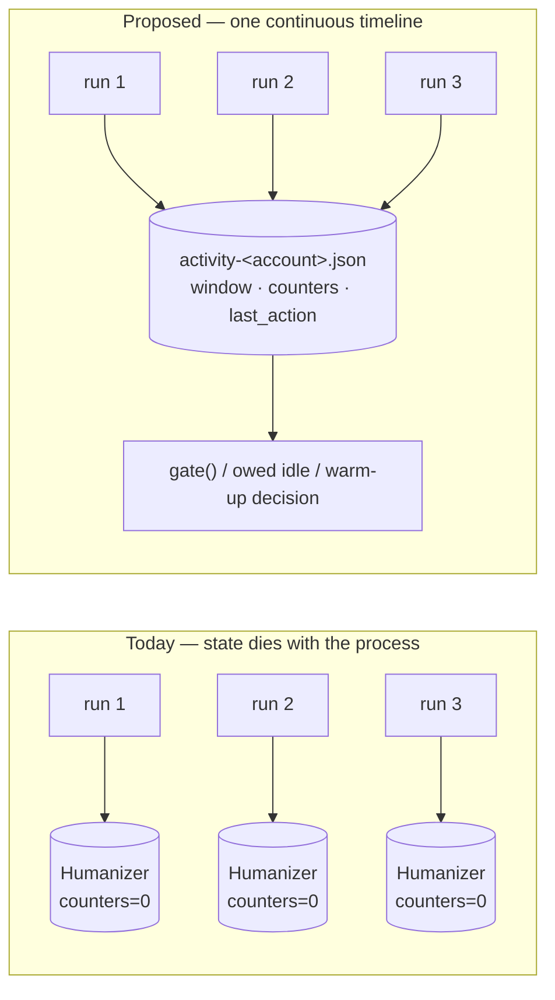

# Proposal: Cross-Session Humanization

## Problem

`human-behavior-simulation` made a single `instascrape` **process** look like a
person using the app. It did nothing about what a *sequence of processes* looks
like, because every piece of pacing state lives in the one `Humanizer` that
`cli.main` constructs (`cli.py:445`) and dies with the process.

Measured, not assumed — ten one-URL runs versus one ten-URL batch, same profile:

```
10 separate runs : idle=    0s   post-counter each run=[1,1,1,1,1,1,1,1,1,1]
one 10-URL batch : idle=  496s   post-counter=10
```

Three distinct leaks, each an *inversion* of the signal the last change bought:

- **No inter-run idle at all.** `cli.main` paces only between posts
  (`if i < len(urls) - 1`, `cli.py:552`), so a one-URL run never calls
  `pace_between_posts`. Ten invocations back-to-back produce **zero** seconds of
  idle — the flagship `post_delay = Range(20, 90)` never fires once. From
  Instagram's side there is no difference between "post 2 of a batch" and "post 1
  of the next invocation"; only our process boundary distinguishes them, and it
  is invisible on the wire.
- **Rate ceilings reset every run.** `self.requests` / `self.posts` start at zero
  and `self._window` starts empty (`behavior.py:130`), so
  `max_requests_per_session = 300`, `max_posts_per_session = 60`, and
  `max_requests_per_window = 200` **cannot bind** across invocations. The rolling
  window is additionally keyed on `time.monotonic()` (`behavior.py:122, 192`),
  which is meaningless outside one process — there is no way to carry it over even
  if we wanted to.
- **Repeated cold app-opens.** `auth.get_client` calls `humanizer.warmup(client)`
  on every session load or login (`auth.py:238, 262, 289`). Ten runs in three
  minutes means ten "just opened the app" bursts. Nobody cold-opens Instagram ten
  times in three minutes; the *repetition* is a signal the single-run design
  cannot see.
- **The session-validation request nobody paces or counts.** `auth.py:236` calls
  `client.get_timeline_feed()` on *every* reused session — before warm-up, before
  any gate, and never `record()`ed. So gating warm-up on a cold open removes the
  0–2 *extra* calls but not the one that is always there: ten invocations still
  emit ten timeline hits in three minutes. Worse, because it is uncounted, no
  ceiling can see it — after a day cap stops the run, every further invocation
  that day still costs one real API call. This is the leak that decides *where*
  the paced timeline begins: not at the first post fetch, but at the first
  packet of the run.

A fifth, subtler one: the active-hours edge jitter is drawn per `Humanizer`
(`behavior.py:135-136`). Across many runs the 08:00/23:00 boundary **flickers**
run to run instead of sitting at one shifted place for the day — the jitter reads
as noise rather than as a person whose bedtime is 23:14 today.

So the current design is honest only for the batch path (`--file`). Anyone
scripting a loop over URLs — the obvious thing to do — silently gets the
unhumanized shape while `post.md` records `humanization on · …`. **Provenance
currently overstates the pacing for that case**, which is its own small bug.

## Proposed change

Persist a tiny **activity ledger** per account and have the `Humanizer` load it
at construction, so pacing state is continuous across invocations rather than
per process.



Concretely:

1. **`activity.py`** — an `ActivityLedger`: load, prune, atomically save a small
   JSON document at `~/.config/instascraper/activity-<account>.json` (chmod 600,
   beside the existing session file). Holds **only timestamps, counters, and a
   random salt** — never URLs, shortcodes, or content.
2. **Wall-clock rolling window.** Replace `time.monotonic()` with UTC epoch
   seconds for the window and all recorded activity, so entries survive a process
   boundary. (Monotonic's immunity to clock adjustment is worth less than
   cross-process meaning at an hour scale; a backwards clock jump is handled
   explicitly rather than silently.)
3. **"Session" becomes an activity session, not a process.** A gap longer than
   `session_idle_reset` (default 30 min) starts a new session and zeroes the
   session counters; anything shorter continues the previous one. This is the
   human notion the ceiling names already imply — you put the phone down for half
   an hour, that's a new sitting.
4. **Owed idle before the first *request*, which means before login.** On startup,
   if the ledger says the last action was *n* seconds ago and a sampled post
   think-time (the same draw the batch path uses between posts, long-pause tail
   included) is longer than *n*, wait the remainder — and wait it *before*
   `get_client`, because the session-validation `get_timeline_feed` is already a
   real request. Ten sequential runs then pace exactly like one batch of ten on
   the wire, not just in their post fetches. The ledger therefore opens before the
   account is known, keyed on the configured username the way
   `auth._settings_path` (`auth.py:123-127`) already keys the session file.
5. **Warm-up only on a cold open**, where "cold open" gets its **own** threshold
   (`foreground_idle`, 5 min) rather than borrowing the session boundary. Ten runs
   in three minutes warm up once — killing the ten-cold-opens signal — while a run
   26 minutes later still warms up, because the app plainly was not open. Two
   questions ("same sitting?" / "app still open?") deserve two numbers.
6. **Per-day ceilings** (`max_posts_per_day`, `max_requests_per_day`). These are
   the payoff of persistence: a daily cap is meaningless without it, which is why
   the previous change shipped only session + window ceilings despite naming a
   day cap in its own proposal.
7. **Stable-for-the-day active-hours edges.** Derive the jitter from the local
   date plus the ledger's per-account salt, so the boundary sits at one place all
   day and moves tomorrow — coherent instead of flickering.
8. **One run at a time.** Hold an exclusive advisory lock on the ledger for the
   duration of a run. A second concurrent `instascrape` for the same account
   waits briefly, then exits with a clear message. Two simultaneous runs are both
   a correctness problem (lost ledger updates) and a behavioral one — a person has
   one phone.
**Deliberately not here: the pacing log.** An append-only trail of every pacing
decision, for the long-horizon questions a single run's stdout structurally cannot
answer, was part of an earlier draft of this proposal and now lives in
`specs/changes/pacing-log/`. It was ~40% of this plan for a file nothing in the tool
reads, and its most valuable events (`owed_idle`, a skipped `warmup`, a day ceiling
binding) do not exist until this change lands. Separate thesis, separate risk,
separate change.

## Scope

**In scope**

- New `activity.py` (ledger: schema, load/prune/atomic-save, lock).
- `behavior.py`: wall-clock window; ledger-seeded counters and window; session
  continuity via `session_idle_reset`; `owed_idle()`; date-derived edge jitter;
  day ceilings; `record()` persists — and no file I/O of its own, as today.
- `auth.py`: warm-up gated on "is this a new session"; the session-validation
  `get_timeline_feed` (`auth.py:236`) recorded like any other request.
- `cli.py`: build the ledger **before login**, pay owed idle before the first
  request of any kind, release the lock and flush the ledger on every exit path.
- `models.py` / provenance: state the ledger was in use, so `post.md` stops
  overstating pacing for loop-driven runs.
- New CLI flags / `.env` keys / env vars for every new parameter, following the
  existing precedence chain.
- README + `specs/system/*` updates.

**Out of scope**

- **Sharing state across machines or accounts.** The ledger is per account, on
  one host. Multi-account rotation stays out of scope, as before.
- **Persisting the RNG stream.** Fresh randomness per run is fine and arguably
  better; only the *date-derived* jitter needs to be stable, and that is computed,
  not carried.
- **A daemon or background scheduler.** The ledger is read/written by the same
  short-lived CLI process; nothing new runs in between.
- **Rewriting the batch path.** `--file` already paces correctly; this change
  makes the multi-invocation path match it, and must not regress it.
- **Proxy / IP rotation, CAPTCHA solving, ToS avoidance.** Unchanged from
  `human-behavior-simulation`; the ToS caveat (`cli.py:124`) stays.
- **The pacing log, and any analytics over it.** `specs/changes/pacing-log/` — a
  separate change, landing after this one. No `instascrape stats` there either.
- **Feeding observed pacing back into the profile.** Auto-tuning from observed
  backoffs needs the log first, and is a follow-up to *that*.

## Expected outcome

- Ten sequential one-URL runs become indistinguishable from one ten-URL batch in
  shape: **nine** post-scale idles instead of zero, drawn from the same
  distribution (long-pause tail included), one warm-up rather than ten, and shared
  ceilings. Not *identical* idle — each run reseeds its RNG, which stays out of
  scope on purpose — but no observable that separates the two paths.
- `max_posts_per_session` / `max_requests_per_window` actually bind, and a
  per-day cap becomes possible at all.
- The active-hours boundary is coherent within a day.
- Provenance stops claiming pacing that a loop-driven run did not get.
- Tests stay network-free and sleep-free: the ledger takes an injected path and
  clock, and no test touches the real `~/.config`.

## Risks & tradeoffs

- **A new stateful file, and state can be wrong.** A corrupt, truncated, or
  future-dated ledger must never fail a run — it warns and starts fresh. Clock
  moved backwards → treat the gap as zero rather than waiting absurdly.
- **Surprising waits.** A run may now idle *before* doing anything, which looks
  like a hang. It must announce itself ("continuing a session — idling 47s
  first"), and be skippable (`--no-activity-ledger`, `--no-humanize`).
- **A stale lock could block runs.** The lock must be advisory, time-bounded, and
  released on every exit path including crashes (OS-level `flock`, not a
  hand-rolled pidfile).
- **Ceilings that persist can *stop* you.** Today's reset-per-run is, from a
  throughput view, a feature; after this change a day's budget is a real budget.
  That is the point, but it needs to be documented loudly and be tunable.
- **A local record of your own activity.** Timestamps and counts only, chmod 600,
  next to the session file — but it is new data at rest and the docs should say so
  plainly, including how to delete it.
- **`--no-humanize` now writes a file.** It stops the waiting and the ceilings, not
  the accounting, so a later humanized run isn't lied to about the day's budget.
  That narrows a documented promise ("the old fast mode") and has to be said out
  loud; `--no-humanize --no-activity-ledger` restores it exactly.
- **No guarantee.** As before: this lowers detection probability; it cannot
  eliminate it. Device history and IP reputation still dominate and remain
  largely outside the tool's control.
