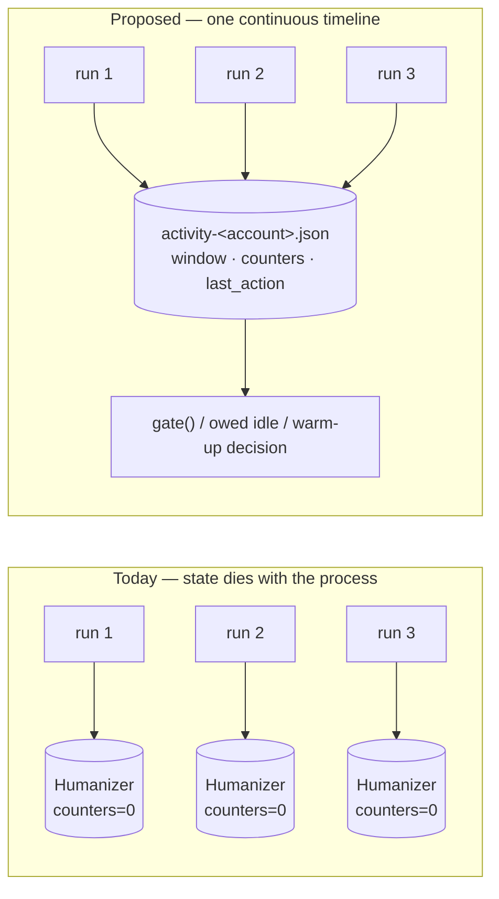

# Proposal: Cross-Session Humanization

## Problem

`human-behavior-simulation` made a single `instascrape` **process** look like a
person using the app. It did nothing about what a *sequence of processes* looks
like, because every piece of pacing state lives in the one `Humanizer` that
`cli.main` constructs (`cli.py:445`) and dies with the process.

Measured, not assumed — ten one-URL runs versus one ten-URL batch, same profile:

```
10 separate runs : idle=    0s   post-counter each run=[1,1,1,1,1,1,1,1,1,1]
one 10-URL batch : idle=  496s   post-counter=10
```

Three distinct leaks, each an *inversion* of the signal the last change bought:

- **No inter-run idle at all.** `cli.main` paces only between posts
  (`if i < len(urls) - 1`, `cli.py:552`), so a one-URL run never calls
  `pace_between_posts`. Ten invocations back-to-back produce **zero** seconds of
  idle — the flagship `post_delay = Range(20, 90)` never fires once. From
  Instagram's side there is no difference between "post 2 of a batch" and "post 1
  of the next invocation"; only our process boundary distinguishes them, and it
  is invisible on the wire.
- **Rate ceilings reset every run.** `self.requests` / `self.posts` start at zero
  and `self._window` starts empty (`behavior.py:130`), so
  `max_requests_per_session = 300`, `max_posts_per_session = 60`, and
  `max_requests_per_window = 200` **cannot bind** across invocations. The rolling
  window is additionally keyed on `time.monotonic()` (`behavior.py:122, 192`),
  which is meaningless outside one process — there is no way to carry it over even
  if we wanted to.
- **Repeated cold app-opens.** `auth.get_client` calls `humanizer.warmup(client)`
  on every session load or login (`auth.py:233, 257, 284`). Ten runs in three
  minutes means ten "just opened the app" bursts. Nobody cold-opens Instagram ten
  times in three minutes; the *repetition* is a signal the single-run design
  cannot see.

A fourth, subtler one: the active-hours edge jitter is drawn per `Humanizer`
(`behavior.py:135-136`). Across many runs the 08:00/23:00 boundary **flickers**
run to run instead of sitting at one shifted place for the day — the jitter reads
as noise rather than as a person whose bedtime is 23:14 today.

So the current design is honest only for the batch path (`--file`). Anyone
scripting a loop over URLs — the obvious thing to do — silently gets the
unhumanized shape while `post.md` records `humanization on · …`. **Provenance
currently overstates the pacing for that case**, which is its own small bug.

## Proposed change

Persist a tiny **activity ledger** per account and have the `Humanizer` load it
at construction, so pacing state is continuous across invocations rather than
per process.



Concretely:

1. **`activity.py`** — an `ActivityLedger`: load, prune, atomically save a small
   JSON document at `~/.config/instascraper/activity-<account>.json` (chmod 600,
   beside the existing session file). Holds **only timestamps, counters, and a
   random salt** — never URLs, shortcodes, or content.
2. **Wall-clock rolling window.** Replace `time.monotonic()` with UTC epoch
   seconds for the window and all recorded activity, so entries survive a process
   boundary. (Monotonic's immunity to clock adjustment is worth less than
   cross-process meaning at an hour scale; a backwards clock jump is handled
   explicitly rather than silently.)
3. **"Session" becomes an activity session, not a process.** A gap longer than
   `session_idle_reset` (default 30 min) starts a new session and zeroes the
   session counters; anything shorter continues the previous one. This is the
   human notion the ceiling names already imply — you put the phone down for half
   an hour, that's a new sitting.
4. **Owed idle before the first post.** On startup, if the ledger says the last
   action was *n* seconds ago and a sampled `post_delay` is longer than *n*, wait
   the remainder before the first fetch. Ten sequential runs then pace exactly
   like one batch of ten.
5. **Warm-up only on a genuinely new session.** `warmup()` fires when the gap
   indicates a cold open, and is skipped mid-session — killing the ten-cold-opens
   signal.
6. **Per-day ceilings** (`max_posts_per_day`, `max_requests_per_day`). These are
   the payoff of persistence: a daily cap is meaningless without it, which is why
   the previous change shipped only session + window ceilings despite naming a
   day cap in its own proposal.
7. **Stable-for-the-day active-hours edges.** Derive the jitter from the local
   date plus the ledger's per-account salt, so the boundary sits at one place all
   day and moves tomorrow — coherent instead of flickering.
8. **One run at a time.** Hold an exclusive advisory lock on the ledger for the
   duration of a run. A second concurrent `instascrape` for the same account
   waits briefly, then exits with a clear message. Two simultaneous runs are both
   a correctness problem (lost ledger updates) and a behavioral one — a person has
   one phone.

## Scope

**In scope**

- New `activity.py` (ledger: schema, load/prune/atomic-save, lock).
- `behavior.py`: wall-clock window; ledger-seeded counters and window; session
  continuity via `session_idle_reset`; `owed_idle()`; date-derived edge jitter;
  day ceilings; `record()` persists.
- `auth.py`: warm-up gated on "is this a new session".
- `cli.py`: build the ledger, pace before the *first* post when idle is owed,
  release the lock and flush the ledger on every exit path.
- `models.py` / provenance: state the ledger was in use, so `post.md` stops
  overstating pacing for loop-driven runs.
- New CLI flags / `.env` keys / env vars for every new parameter, following the
  existing precedence chain.
- README + `specs/system/*` updates.

**Out of scope**

- **Sharing state across machines or accounts.** The ledger is per account, on
  one host. Multi-account rotation stays out of scope, as before.
- **Persisting the RNG stream.** Fresh randomness per run is fine and arguably
  better; only the *date-derived* jitter needs to be stable, and that is computed,
  not carried.
- **A daemon or background scheduler.** The ledger is read/written by the same
  short-lived CLI process; nothing new runs in between.
- **Rewriting the batch path.** `--file` already paces correctly; this change
  makes the multi-invocation path match it, and must not regress it.
- **Proxy / IP rotation, CAPTCHA solving, ToS avoidance.** Unchanged from
  `human-behavior-simulation`; the ToS caveat (`cli.py:124`) stays.

## Expected outcome

- Ten sequential one-URL runs pace like one ten-URL batch: real `post_delay`
  idle between them, one warm-up rather than ten, and shared ceilings.
- `max_posts_per_session` / `max_requests_per_window` actually bind, and a
  per-day cap becomes possible at all.
- The active-hours boundary is coherent within a day.
- Provenance stops claiming pacing that a loop-driven run did not get.
- Tests stay network-free and sleep-free: the ledger takes an injected path and
  clock, and no test touches the real `~/.config`.

## Risks & tradeoffs

- **A new stateful file, and state can be wrong.** A corrupt, truncated, or
  future-dated ledger must never fail a run — it warns and starts fresh. Clock
  moved backwards → treat the gap as zero rather than waiting absurdly.
- **Surprising waits.** A run may now idle *before* doing anything, which looks
  like a hang. It must announce itself ("continuing a session — idling 47s
  first"), and be skippable (`--no-activity-ledger`, `--no-humanize`).
- **A stale lock could block runs.** The lock must be advisory, time-bounded, and
  released on every exit path including crashes (OS-level `flock`, not a
  hand-rolled pidfile).
- **Ceilings that persist can *stop* you.** Today's reset-per-run is, from a
  throughput view, a feature; after this change a day's budget is a real budget.
  That is the point, but it needs to be documented loudly and be tunable.
- **A local record of your own activity.** Timestamps and counts only, chmod 600,
  next to the session file — but it is new data at rest and the docs should say so
  plainly, including how to delete it.
- **No guarantee.** As before: this lowers detection probability; it cannot
  eliminate it. Device history and IP reputation still dominate and remain
  largely outside the tool's control.
