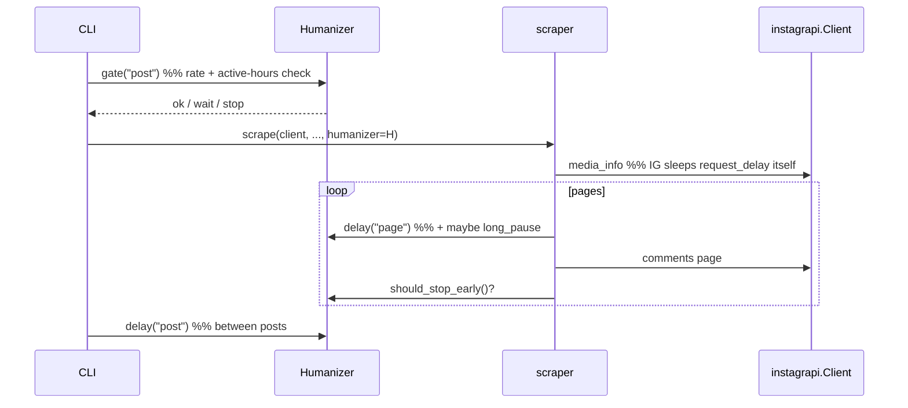
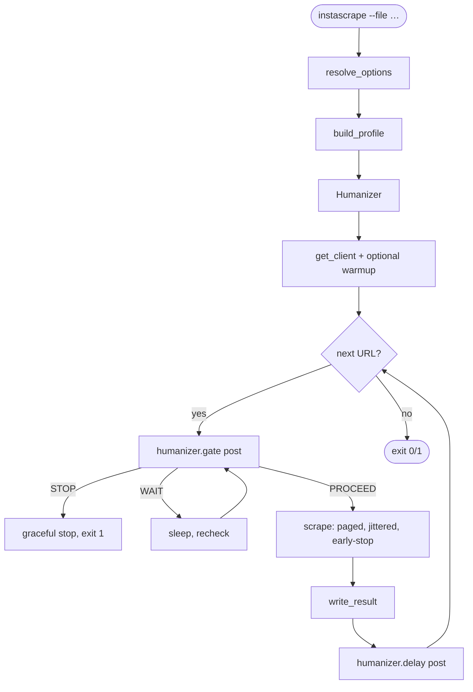

# Architecture: Human-Behavior Simulation

> Read `proposal.md` (what & why) and `domain.md` (vocabulary) first.

## Overview

One new module, `instascraper/behavior.py`, owns **all** pacing policy. It
exposes a `BehaviorProfile` (pure data) and a `Humanizer` (samples delays,
decides early-stops, enforces rate ceilings). Call sites in `scraper.py`,
`cli.py`, and `auth.py` gain thin hooks that ask the humanizer *when* and *how
long* to wait — they never contain timing constants themselves.

```mermaid
flowchart TD
    CLI["cli.py — resolve options, batch loop"] --> BUILD["behavior.build_profile(opts)"]
    BUILD --> PROFILE["BehaviorProfile (dataclass)"]
    CLI --> HUM["Humanizer(profile, rng, clock)"]
    HUM -->|delay(post), gate()| CLI
    CLI --> SCRAPE["scraper.scrape(..., humanizer)"]
    SCRAPE -->|delay(page), should_stop_early()| HUM
    CLI --> AUTH["auth.get_client(..., humanizer)"]
    AUTH -->|warmup(), delay(warmup)| HUM
    HUM --> CLIENT[("instagrapi.Client\n(delay_range from profile)")]
    HUM --> RNG[["random.Random(seed)"]]
    HUM --> CLOCK[["clock: time.sleep / monotonic\n(injectable)"]]
```

## Key decisions

### 1. Single profile, sampled ranges, one randomizer

`BehaviorProfile` is a frozen dataclass of `(min, max)` ranges, probabilities,
and ceilings — no scalars-that-should-have-been-ranges. The `Humanizer` owns a
`random.Random` seeded from the profile (or `None` = nondeterministic in
production). This directly realizes the request's "real 2–7 seconds": every
parameter is a range, sampled per use.

```python
@dataclass(frozen=True)
class Range:
    lo: float
    hi: float
    # sample(rng)      -> rng.uniform(lo, hi)          (float delays)
    # sample_int(rng)  -> rng.randint(int(lo), int(hi)) (integer counts, e.g. warmup_calls)

# Defaults calibrated against the live capture in `observations.md`: a real
# session is short bursts separated by *long, high-variance idle* (observed
# 4.4 s → 22 s → 57 s between actions), comments read a screenful then abandoned.
@dataclass(frozen=True)
class BehaviorProfile:
    enabled: bool = True
    request_delay: Range = Range(1.0, 4.0)     # between private API calls (small; observed intra-burst)
    page_delay:    Range = Range(2.0, 8.0)     # between comment pages (observed 0.9–3 s + think time)
    post_delay:    Range = Range(20.0, 90.0)   # between posts — the dominant idle (observed 22–57 s)
    long_pause:    Range = Range(30.0, 120.0)  # occasional "distracted" gap (tail beyond post_delay)
    long_pause_prob: float = 0.2
    early_stop_prob: float = 0.3               # per-page chance to stop reading (comments are shallow)
    warmup_calls:  Range = Range(0, 2)         # app-open benign calls (drawn via sample_int)
    max_requests_per_session: int = 300
    max_posts_per_session: int = 60
    window_seconds: int = 3600                 # rolling window
    max_requests_per_window: int = 200
    active_hours: tuple[int, int] | None = (8, 23)  # local; None = anytime
    backoff_base: float = 60.0
    backoff_max: float = 900.0
    backoff_attempts: int = 3
    seed: int | None = None                    # set in tests for determinism
```

Rationale: a reviewer reads one dataclass and knows every way the tool paces
itself. Defaults are chosen to resemble a person casually browsing, not to be
maximally fast.

### 1b. Device-identity continuity (ranks above cadence)

`observations.md` §0 records a real event: a fresh **Chrome** login tripped a
new-device alert *before any scraping cadence existed*. Device/login novelty is
the first gate; cadence only matters after it. Two concrete measures, both
**configuration, not randomization** (identity must stay *stable*, the opposite
of the sampled delays):

1. **Coherent device family.** This account's history is **iOS app + Safari**,
   but instagrapi defaults to an **Android** device. Expose a `device_profile`
   option (e.g. `ios` | `android`) that seeds instagrapi's device settings
   (`set_device` / `set_user_agent`) to an **iOS** profile matching the account's
   real usage. Persist it in the session so it never drifts between runs.

   **Migration — existing sessions are never silently re-fingerprinted.** A
   persisted session already carries a device family (Android, for anyone who
   ran the tool before this change). Changing the device of a live session *is
   itself* a new-device event — the exact harm we're avoiding. So `get_client`:
   - On a **loaded/reused** session, keeps whatever device the session already
     has. `device_profile` is **not** applied to it; the session is authoritative.
   - Applies `device_profile` **only when minting a new session** (no session
     file, or an explicit password/browser login).
   - If a loaded session's device family differs from the configured
     `device_profile`, does **not** re-login. It logs one line —
     "session uses `android`; config requests `ios`; keeping the existing
     session. To switch, delete `session-<user>.json` and log in again (expect a
     one-time new-device prompt — confirm it was you)." — and proceeds. Switching
     is thus a **deliberate, user-initiated, one-time** action, never an
     automatic upgrade side effect.

   This makes the Android→iOS move a **one-way, opt-in** migration with a stated
   cost (one new-device prompt), rather than an unstated break on upgrade.
2. **Minimize logins.** The existing session-reuse + stable-UUID path
   (`auth.py`) is already the right shape; humanization must not add logins.
   Prefer bootstrapping from an existing trusted session; treat every fresh
   `Client.login` as a flag-risk event and never re-login speculatively.

This is not part of the `BehaviorProfile` (which is all *sampled* timing) — it
lives in the device/session setup in `auth.py`. It is called out here because the
field evidence puts it *above* cadence in impact.

### 2. Humanizer wraps timing; instagrapi's own delay is derived, not doubled

instagrapi already sleeps `delay_range` before each private request. We **set
`client.delay_range` from `profile.request_delay`** rather than adding a second
sleep around every low-level call — that keeps per-request pacing in one place
and avoids double-waiting. The `Humanizer` then adds the *higher-level* pauses
that instagrapi has no concept of: between comment pages, between posts, warm-up,
long read pauses, and rate gating.

**Scope note — we do not reshape request-level cadence into bursts.**
`observations.md` §3 shows a real action fires a tight ~1.8 s burst of ~9
near-parallel calls; we deliberately do **not** try to reproduce that shape (it
lives inside instagrapi's per-endpoint fan-out, which we don't control). The
per-request `delay_range` stays a small uniform pause. The behavioral win this
change buys is entirely at the **higher level** — the long, high-variance idle
*between* logical actions (`post_delay`, `long_pause`), human-scale depth, and
rate gating. That is the axis on which the current tool is the loudest inverse of
a human; request-level micro-shape is not.



### 2b. Human-scale comment depth: early-stop + a clamp on `scan-limit 0`

Two mechanisms, both only active when humanization is on:

- **Per-page early-stop.** `should_stop_early()` draws against `early_stop_prob`
  after each page, so depth varies post-to-post (a human reads a screenful and
  moves on) instead of always hitting the exact same count.
- **`--comment-scan-limit 0` is clamped, not honored literally.** Paging *every*
  comment (thousands of requests) is, per `proposal.md`, one of the loudest bot
  signals. Under humanization, `scan_limit == 0` is treated as the standard
  default depth (**200**) with a one-line notice ("humanized: scanning ~200
  comments, not all; pass `--no-humanize` to scan everything"). `--no-humanize`
  preserves today's `0 = all` behavior exactly. Early-stop still applies on top,
  so the effective depth is usually well under the clamp.

### 3. Injectable clock and RNG → deterministic, sleep-free tests

`Humanizer(profile, rng=None, sleep=time.sleep, now=time.monotonic,
wall=datetime.now)`. Tests pass a seeded `random.Random`, a `sleep` that records
durations instead of blocking, and a fake `wall` clock for active-hours/rolling
-window logic. No test ever sleeps or hits the network — consistent with the
existing network-free suite (`architecture.md` cross-cutting).

### 4. Rate ceilings as a rolling deque + counters

The humanizer keeps a `deque` of request timestamps (via `now()`) and simple
session counters. `gate(kind)` checks session ceilings, the rolling-window
ceiling, and active-hours, returning `PROCEED`, `WAIT(seconds)`, or `STOP`. The
CLI decides policy: `WAIT` → sleep and retry; `STOP` → end the batch gracefully
with a clear message and the partial-success exit code.

**`WAIT` is always short; long waits become `STOP`.** A `WAIT` is only ever
issued for the **rolling-window** ceiling, so it is bounded by `window_seconds`
(≤ 1 h by default) — a plausible human pause. **Outside active hours the gate
returns `STOP`, not `WAIT`** — the tool never silently sleeps for hours until the
window opens. Rationale: a multi-hour blocking sleep is a surprising, un-
interruptible failure mode; ending gracefully (partial-success exit, "outside
active hours 08:00–23:00 — stopping; re-run during the window or pass
`--no-humanize`") is clearer and lets the user decide. Session/day ceilings
likewise return `STOP`, not `WAIT`.

### 5. Politeness backoff replaces immediate fatal on rate signals

`PleaseWaitFewMinutes` currently triggers an immediate `EXIT_FATAL`
(`cli.py:270`). With humanization on, the humanizer computes a jittered
exponential backoff (`backoff_base * 2**attempt` capped at `backoff_max`, ±
jitter) and the CLI waits and retries up to `backoff_attempts` before giving up.
`LoginRequired` / `ChallengeRequired` remain immediately fatal (waiting won't
help).

### 6. Configuration: reuse the existing precedence chain

Every parameter gets an `ENV_KEYS` entry and a CLI flag, resolved by the
existing `_pick` precedence (**CLI > .env > env var > default**, `cli.py:189`).
Ranges are passed as `"lo,hi"` strings on the CLI / in `.env` and parsed in
`behavior.build_profile`. A single `--no-humanize` flag sets `enabled=False`
(and skips all sampling/gating, restoring today's fast behavior). To keep the
`.env` readable, group the humanization keys under an `INSTASCRAPE_HUMANIZE_*`
prefix.

**`--delay` is *not* aliased onto `post_delay`.** `resolve_options` fills
`delay=3.0` unconditionally (`cli.py:206`) and `save_config` persists it to
`.env` every run (`cli.py:241`), so by the time `build_profile(opts)` runs it
cannot tell a user-chosen `3` from the default. Mapping that onto `post_delay`
would silently pin the flagship `Range(20, 90)` idle to a fixed 3 s for every
existing user. So instead:

- Inter-post pacing under humanization comes **only** from `post_delay`
  (`INSTASCRAPE_HUMANIZE_POST_DELAY="lo,hi"`). `--delay` / `INSTASCRAPE_DELAY`
  feed **only** the `--no-humanize` fixed-sleep path — exactly today's behavior.
- When humanization is on (default) **and** the user passed `--delay`
  *explicitly* (detected as `args.delay is not None`, not the resolved `3.0`),
  emit a one-time deprecation notice — "`--delay` is ignored under humanization;
  use `--humanize-post-delay lo,hi`" — and ignore it. A `delay` value sitting in
  `.env` from a prior run is silently ignored under humanization (no notice), so
  upgrading users are never surprised by a 3 s idle.
- Precedence when both are relevant: `--no-humanize` → `--delay` wins (fixed
  sleep); humanization on → `post_delay` wins, `--delay` disregarded.

## Integration points

| File | Change |
|------|--------|
| `behavior.py` *(new)* | `Range`, `BehaviorProfile`, `Humanizer`, `build_profile(opts)`, `GateResult`. All pure/injectable. |
| `auth.py` | Set `client.delay_range` from `profile.request_delay` instead of the constant `DELAY_RANGE`; optional `humanizer.warmup(client)` after a fresh login/session load. |
| `scraper.py` | `scrape(..., humanizer=None)`; `_scan_comments` calls `humanizer.delay("page")` per page and honors `humanizer.should_stop_early()`; a `None` humanizer preserves current behavior for library callers. |
| `cli.py` | Build the profile from resolved options; construct one `Humanizer`; `gate("post")` before each post; `humanizer.delay("post")` between posts (replacing fixed `--delay`); jittered backoff on `PleaseWaitFewMinutes`; new flags + `ENV_KEYS`. Update the `cli.py:245` progress banner ("paced ~1–3s/request, Ns between posts") to reflect humanized pacing (or say "humanized"). |
| `config.py` | New `ENV_KEYS` entries for each humanization parameter. |
| `models.py` / `Provenance` | Record the effective profile (or a hash/summary) so an export states how it was paced. Also add a `comments_scanned` field for the **actual** number paged (distinct from the configured `comment_scan_limit`), since early-stop/clamp make the two differ and the top-10 is ranked over that variable set — provenance must not overstate depth. |
| `README.md`, `specs/system/*` | Document new flags and the humanization concept. |

## Data / control flow (batch run)



## Testing strategy

- **Range sampling**: seeded RNG → assert `delay(kind)` falls in range and that
  `long_pause` fires at the configured probability over many draws.
- **Early stop**: seeded RNG → `_scan_comments` stops before the limit at the
  expected rate; `early_stop_prob=0` reproduces today's exhaustive paging.
- **Rate gating**: fake `now()`/`wall` → session and window ceilings return
  `STOP`/`WAIT`; active-hours boundary respected with jitter.
- **Backoff**: fake sleep records the jittered exponential schedule; caps at
  `backoff_max`; gives up after `backoff_attempts`.
- **Config**: `"lo,hi"` parsing round-trips; precedence CLI > .env > env > default
  holds; `--no-humanize` disables all pacing.
- **Regression**: with `humanizer=None` (library path), `scrape` behaves exactly
  as today. No test sleeps or touches the network.

## Rejected alternatives

- **Wrap every `private_request` in our own sleep.** Rejected — double-sleeps
  with instagrapi's built-in `delay_range` and scatters timing across call sites.
  Setting `delay_range` from the profile keeps per-request pacing single-sourced.
- **Playwright/Chrome-driven scraping** to mimic browser signals. Rejected as the
  scraping mechanism — the tool is mobile-API based; a browser path would be a
  second, heavier backend and still be fingerprinted. Retained only as an
  optional offline *validation* capture (see `plan.md`).
- **Hardcoded "good" delays.** Rejected — violates the explicit requirement that
  parameters be real, randomized ranges; also un-tunable and un-testable.
