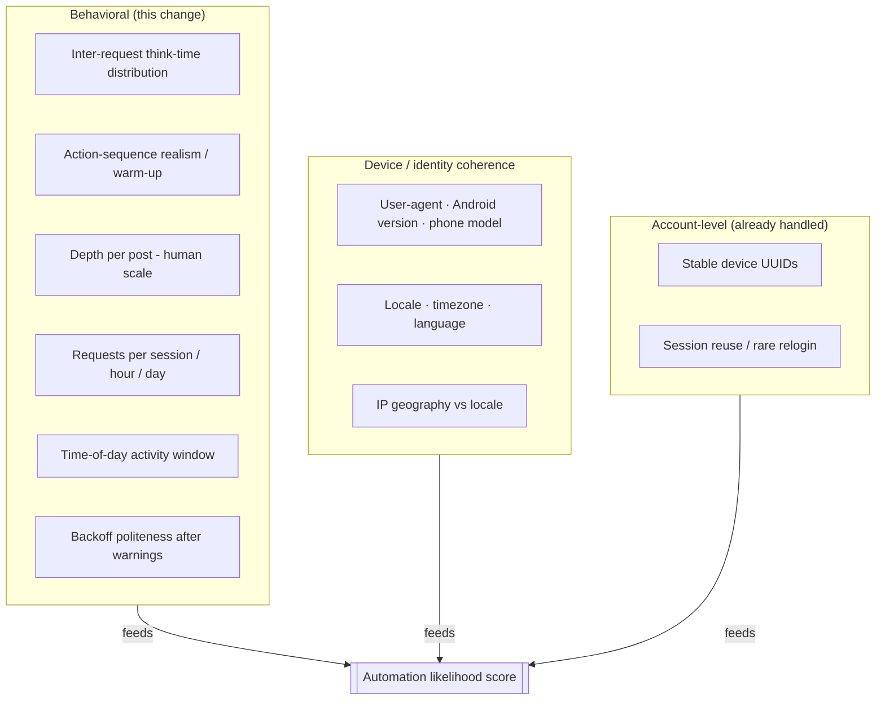
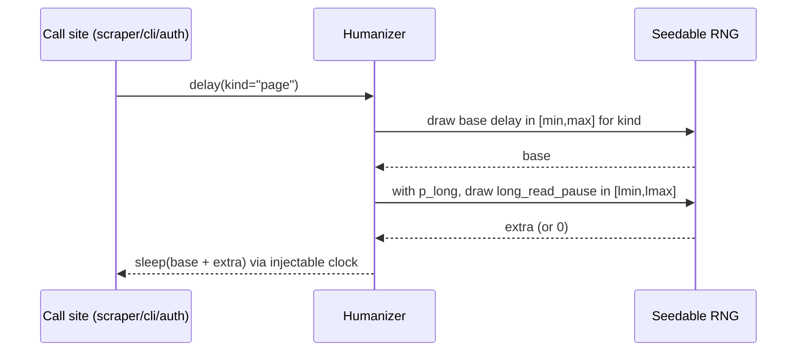
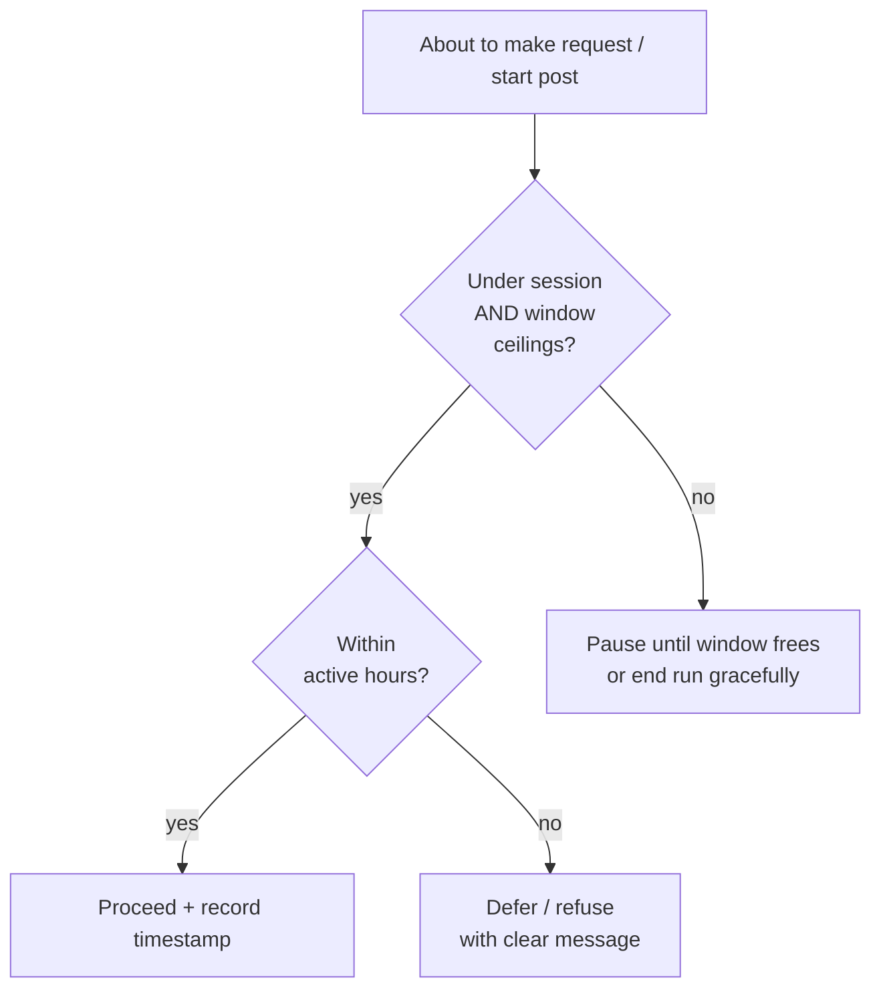

# Domain: Human-Behavior Simulation

New and refined vocabulary introduced by this change. Extends
`specs/system/domain.md` — existing terms (Session, Credentials, device UUIDs)
are unchanged.

## What Instagram's automated defenses actually observe

Because the tool speaks the **private mobile API** (not a browser), the signals
that matter are the ones a real Instagram *app* would or would not emit.

## Glossary

| Term | Meaning |
|------|---------|
| **Behavior profile** | The single, fully parameterized model of human-like usage: every delay range, pause probability, depth jitter, rate ceiling, and active-hours window. Loaded via the existing precedence chain (CLI flag > `.env` > env var > default). No timing constant lives at a call site. |
| **Humanizer** | The runtime object that *applies* a behavior profile: samples a delay for a given action, decides probabilistic early-stops, and enforces rate ceilings. Holds a seedable RNG and an injectable clock so behavior is deterministic and sleep-free under test. |
| **Think-time** | The pause a human takes between two actions (reading, deciding). Modeled per action kind as a sampled delay, not a fixed constant. Replaces / enriches instagrapi's uniform `delay_range`. |
| **Action kind** | The category of pause being sampled — `request` (between API calls), `page` (between comment pages), `post` (between posts in a batch), `read_pause` (occasional long "reading" gap), `warmup` (app-open calls). Each kind has its own configurable range. |
| **Long read pause** | An occasional, deliberately larger gap (e.g. the user got distracted). Governed by a probability and a separate, wider range — the tail that even-spacing never produces. |
| **Depth jitter / early give-up** | Human-scale comment reading: rather than always paging to the scan limit, stop early with a configurable probability. Makes "how deep did we read" vary post to post instead of always hitting the exact same count. |
| **Warm-up** | A small number of benign, app-like calls at session start (e.g. the timeline feed already fetched for session validation in `auth.py:152`) to resemble opening the app before viewing a specific post. Count and inclusion are configurable. |
| **Rate ceiling** | A configurable cap on activity: max requests/posts per **session** and per **rolling window** (e.g. per hour, per day). Hitting the rolling-window cap triggers a bounded `WAIT`; hitting a session/day cap ends the run gracefully (`STOP`) instead of continuing. |
| **Active-hours window** | A configurable local-time window during which automated activity is plausible (e.g. 08:00–23:00), with edge jitter so the boundary isn't a hard clock tick. Activity outside it ends the run gracefully (`STOP`) rather than blocking for hours until the window opens — the tool never silently sleeps overnight. |
| **Gate result** | The verdict `gate(kind)` returns before an action: `PROCEED` (go), `WAIT(seconds)` (a **bounded** pause, only for the rolling-window ceiling), or `STOP` (end the run gracefully — session/day ceiling hit, or outside active hours). |
| **Device/locale coherence** | The requirement that user-agent, Android/app version, locale, timezone, and (ideally) IP geography tell a consistent story. Incoherence (e.g. US device string, German locale, Asian IP) is a static fingerprint flag independent of pacing. |
| **Politeness backoff** | Jittered, exponential wait after a `PleaseWaitFewMinutes` / rate-limit signal — behaving like a human who simply waits — instead of an immediate fatal stop. Max attempts and backoff bounds are configurable. |
| **Humanization toggle** | A single switch (`--no-humanize`) to run in the old fast, unhumanized mode when the user explicitly accepts the detection risk (e.g. one-off scrape of their own post). Off by default; humanization on by default. |

## Processes

### Sampling a think-time (per action)

### Enforcing a rate ceiling

## Actors & key rules

- **The user** stays the sole actor and still archives only content they can
  already see. This change does not enable new access; it makes existing access
  *paced like a person*.
- **One source of truth for timing.** All delays, probabilities, ceilings, and
  windows live in the behavior profile. A reviewer can read one dataclass and
  know every way the tool paces itself.
- **Randomized, never fixed.** Every delay is sampled from a configurable range;
  the request's "real 2–7 seconds" is the shape of every parameter, not a
  special case.
- **Deterministic under test.** The humanizer takes an injected RNG seed and
  clock; tests assert sampled values and never actually sleep.
- **Honest limits.** Behavioral realism lowers, but cannot eliminate, detection
  risk; device/IP coherence and account history also matter and are partly
  outside the tool's control.
