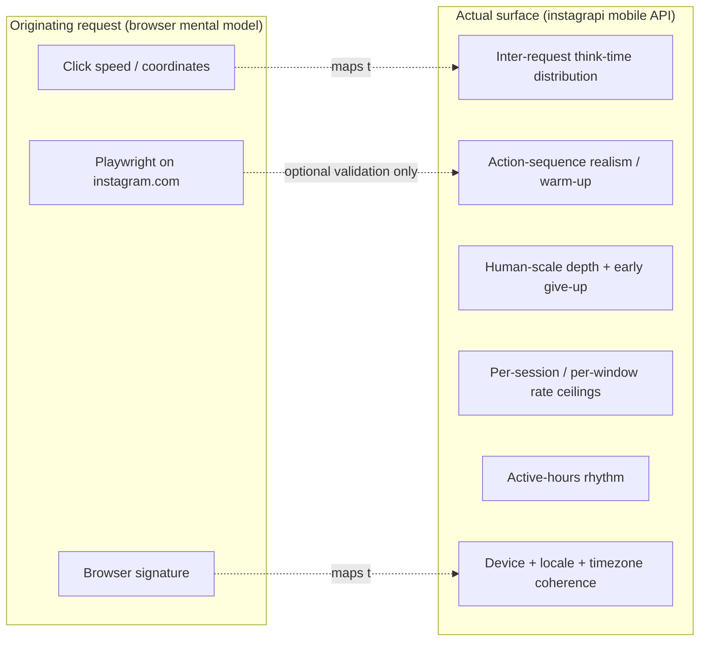

# Proposal: Human-Behavior Simulation

## Problem

Instagram has begun surfacing automation warnings / challenge prompts on the
account used by `instascrape`, threatening a block. The current tool behaves in
ways that are cheap for Instagram's automated defenses to fingerprint:

- **Metronomic pacing.** Every private API call is spaced by the same uniform
  `delay_range = [1, 3]` s (`auth.py:31`), and batch mode sleeps a *fixed*
  `--delay` (default 3 s, `cli.py:206`) between posts. A **live capture of the
  real web client** (logged in as @tillg — see `observations.md`) shows the
  opposite shape: opening one post fires a **~1.8 s burst of ~9 near-parallel
  requests**, then goes **idle for 4–57 s** until the next user action. Idle
  dominates; the scraper's even 1–3 s drip with no idle is the inverse.
- **Machine-like request sequences.** A run does `media_pk_from_url → media_info
  → comments page → comments page → …` in a tight loop and nothing else. The
  real app interleaves feed, reels tray, story tray, and profile calls, with
  read pauses in between. *This change addresses the cold-start end of that — a
  small, varied **warm-up** at session open (item 6) — but does **not** attempt
  full feed/story interleaving mid-batch; see "Out of scope".*
- **Unnatural depth.** `--comment-scan-limit 0` pages through *every* comment of
  a post (thousands of requests). No human loads 3,000 comments; this is one of
  the loudest bot signals available.
- **No rate ceiling.** Nothing caps requests per session, per hour, or per day,
  and nothing confines activity to plausible active hours. A 200-URL batch at
  04:00 with even spacing is trivially flagged.

- **Device-family mismatch (ranks above cadence).** A live capture (see
  `observations.md` §0) shows Instagram flagged a *new-device* login **before any
  scraping cadence existed**. The account's real history is **iOS app + Safari**,
  but instagrapi defaults to an **Android** device — a static fingerprint
  mismatch independent of pacing. The session-reuse + **stable device UUIDs**
  path (`auth.py:176`, `architecture.md:60`) is correct and stays; what is wrong
  is the emulated device *family*.

Two things are missing, then: **device-identity coherence** (make the emulated
device match how the account is actually used) and **behavioral** realism at the
request-timing and request-sequence layer. Field evidence puts device coherence
*above* cadence in impact.

## Important scoping correction

The originating request suggested driving Instagram with Playwright/Chrome and
matching **browser** signals (browser signature, click speed, coordinates).
**`instascrape` never uses a browser.** Its entire fetch/download path is
`instagrapi`, Instagram's *private mobile API* (`architecture.md:7`). Therefore:

- The detection surface is the **mobile-app request cadence, device-fingerprint
  coherence, request volume, and action-sequence realism** — not browser
  fingerprints or mouse timing.
- "Simulate a human clicking" translates here to **"simulate a human using the
  Instagram app"**: realistic think-time between API calls, plausible action
  interleaving, believable session length, and human-scale depth.
- A live browser traffic capture (Playwright on `web.instagram.com` while logged
  in as the user) is retained only as an **optional validation step** to compare
  observed human cadence against our simulated cadence. It is not on the critical
  path and requires the user's own interactive login.

## Proposed change

Introduce a **behavior profile** — a single, fully parameterized model of
human-like usage — and thread it through auth, scraping, and the batch loop.
**Every timing value becomes a configurable range sampled by a randomizer**, per
the request ("waiting before clicking another real 2–7 seconds"). Nothing is
hardcoded at a call site; defaults live in one place and are overridable via CLI
flag, `.env`, and environment variable using the existing precedence chain
(`cli.py:1`).

Concretely, the change adds:

1. **`behavior.py`** — a `BehaviorProfile` dataclass holding every tunable
   (delay ranges, pause probabilities, depth jitter, rate ceilings, active
   hours, device/locale coherence), plus a seedable `Humanizer` that samples
   delays and enforces rate limits against an injectable clock/RNG (so tests are
   deterministic and never sleep).
2. **Richer pacing** than uniform `delay_range`: per-request think-time drawn
   from a skewed distribution, with an occasional configurable "long read pause".
3. **Human-scale comment depth**: probabilistic early stop while paging, and
   clamping `--comment-scan-limit 0` to a human-scale default (≈200) under
   humanization (`--no-humanize` keeps `0 = all`).
4. **Randomized inter-post delay** (range, not a fixed number) with occasional
   longer breaks.
5. **A rate limiter**: per-session and per-rolling-window request/post ceilings,
   and an optional **active-hours** window; exceeding a ceiling pauses or stops
   gracefully rather than plowing ahead.
6. **Optional warm-up**: a small number of benign app-like calls (e.g. the
   timeline feed already used for session validation) at session start, to
   resemble opening the app before viewing a specific post.
7. **Jittered backoff** on `PleaseWaitFewMinutes` / rate-limit responses instead
   of an immediate fatal stop where a human would simply wait.

## Scope

**In scope**

- New `behavior.py` module (profile + humanizer + rate limiter).
- **Device-identity coherence**: a `device_profile` option (`ios` | `android`,
  default `ios` to match this account's real usage) that seeds instagrapi's
  device on first login and persists it so it never drifts (`architecture.md`
  §1b, `plan.md` §6b). Stable UUIDs and session reuse are unchanged; only the
  device *family* becomes coherent.
- Wiring into `scraper._scan_comments`, `scraper.scrape`, the `cli.main` batch
  loop, and optional warm-up in `auth.get_client`.
- New CLI flags / `.env` keys / env vars for every parameter, with human-like
  defaults.
- Seedable RNG + injectable clock for deterministic, sleep-free tests.
- README + system-spec updates (user-visible new flags).

**Out of scope**

- Changing the **stable UUIDs / session-reuse** mechanics — already correct and
  untouched. (The emulated device *family* is in scope, per above; the persisted
  session and UUID stability are not.)
- **Full mid-batch action interleaving** (weaving feed / story / reels-tray calls
  between posts). Session-open warm-up is in scope; simulating a full app browsing
  session around each fetch is not — lower value for the cost, and easy to get
  wrong. Warm-up is the deliberate, lighter approximation of action-sequence
  realism.
- Browser automation of `web.instagram.com` for scraping (the tool is mobile-API
  based); Playwright is validation-only and optional.
- Proxy / IP rotation, multi-account rotation, CAPTCHA solving — out of scope and
  not requested.
- Defeating Instagram's ToS enforcement in general. This change reduces
  *behavioral* fingerprinting for personal-use archiving; the existing ToS
  caveat (`cli.py:124`) stays.

## Expected outcome

- The emulated device family matches the account's real usage (iOS by default),
  seeded once and persisted — closing the new-device fingerprint gap that
  `observations.md` §0 showed fires before cadence even matters.
- All timings are randomized ranges owned by one profile; no bare `sleep`
  constants at call sites.
- A default run "looks like" a person occasionally opening the app and reading a
  post: variable think-time, human-scale comment depth, plausible session
  length, respect for active hours and rate ceilings.
- Power users can tune or disable every parameter; tests stay fast and
  deterministic via a seeded RNG and fake clock.
- Reduced rate of automation challenges on the account. A live capture of the
  real client's cadence has already been taken (`observations.md`) and the
  default `BehaviorProfile` ranges are calibrated against it; field results
  remain the ultimate measure.

## Risks & tradeoffs

- **Slower runs.** Human-like pacing is deliberately slower. Mitigated by making
  every parameter tunable and by keeping an explicit "fast/unhumanized" escape
  (e.g. `--no-humanize`) for cases the user accepts the risk.
- **No guarantee.** Behavioral realism lowers detection probability; it cannot
  guarantee Instagram won't flag an account. The proposal is honest about this.
- **Complexity.** A new module + wiring. Kept minimal: one dataclass, one
  humanizer, thin call-site hooks; all logic is pure and injectable for testing.
