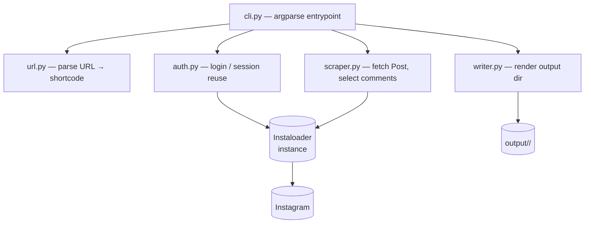
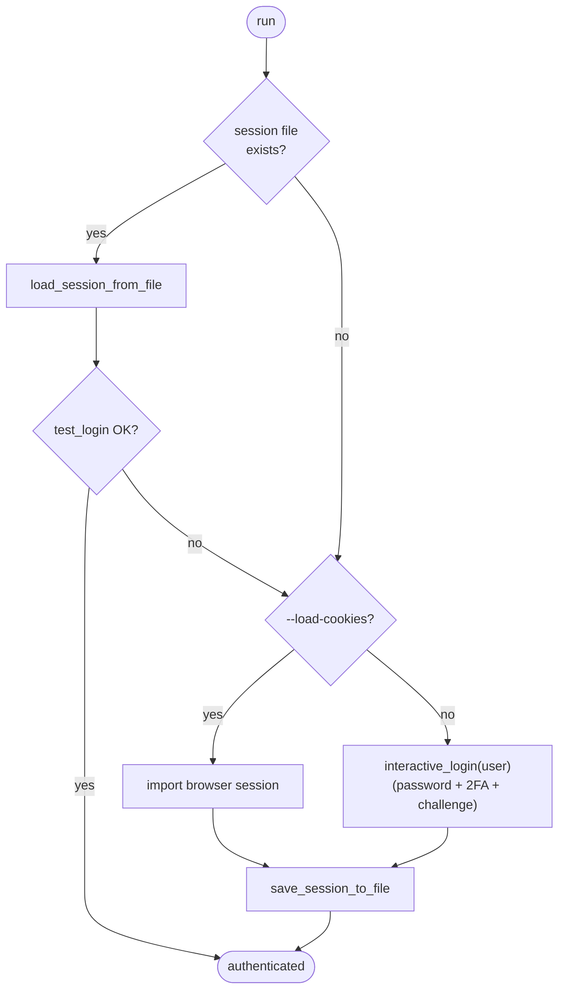
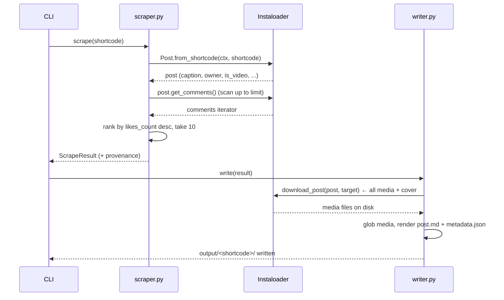

# Architecture: Initial Instagram Scraper

> Read `proposal.md` and `domain.md` first for the what/why and vocabulary.

## Key decision: use Instaloader

**Decision: Instaloader** (confirmed against `RESEARCH_SCRAPING.md` and
`RESEARCH_SCRAPING_SOLUTION.md`). It is purpose-built for this — credential +
session login, session persistence + validation, 2FA, shortcode resolution,
all-media download (including carousels), and comment iteration — so our job is
a thin wrapper, not a scraper from scratch.

Rejected, briefly: the **official Graph API / OAuth** and **Meta Content Library
API** cannot serve a personal archive of *arbitrary* public reels (OAuth reaches
only authorized professional accounts; the Content Library is a vetted-researcher
cleanroom). **Browser automation** (Playwright) is heavy and brittle — last
resort only. The research steered hard toward OAuth, but that targets a
production SaaS over *authorized* accounts; for content the user can already see
while logged in, credential + session login is the appropriate,
practitioner-endorsed path. ToS / personal-data tradeoffs are in `proposal.md`.

**`instagrapi` is the documented fallback.** It is another credential + session
library, but with finer-grained comment endpoints (e.g. Instagram-UI-style
"top" ordering) and its own album/reel download helpers. If Instaloader's
comment ordering or media coverage ever proves insufficient, we swap the scraper
backend to instagrapi without changing the CLI or the output format.

## Component overview



| Module | Responsibility |
|--------|----------------|
| `cli.py` | Parse args (`url` or `--file`, flags), orchestrate, handle errors & exit codes, apply inter-item delay for batch. |
| `url.py` | Extract the shortcode from `/p/`, `/reel/`, `/tv/` URLs. Pure function, easy to unit-test. |
| `auth.py` | Build the `Instaloader` instance; load + `test_login()`-validate a saved session, else `interactive_login()` (password / 2FA / challenge) or `--load-cookies` import, then save the session. |
| `scraper.py` | `Post.from_shortcode()`, read caption/owner/metadata, scan + rank comments. Returns a plain `ScrapeResult` dataclass. |
| `writer.py` | Given a `ScrapeResult` + the Instaloader instance, call `download_post()` (all media), then write `post.md` + `metadata.json` (with provenance) into `output/<shortcode>/`. |

The internal data carrier is a `ScrapeResult` dataclass (shortcode, owner,
caption, taken_at, likes, is_video, comments list, provenance) so `scraper.py`
is decoupled from `writer.py` and unit-testable without network. Media files are
not threaded through it — `download_post()` writes them and `writer.py` globs
the directory to list them.

## Authentication & session flow



- First choice is **session reuse**: load the session file and confirm it with
  `test_login()`; only fall through to a fresh login if it fails. Reusing a
  valid session is the single most important defense against login challenges.
- Fresh login uses Instaloader's **`interactive_login(username)`**, which prompts
  for the password and handles 2FA codes and security challenges inline — no
  hand-rolled `two_factor_login` flow. Username comes from `IG_USERNAME` or a
  prompt; the password is read by `interactive_login` and **never** stored or
  logged (the session file holds a cookie, not the password).
- Alternatively `--load-cookies` imports an existing browser session, skipping
  password entry entirely, then saves it for reuse.
- Session file lives at `~/.config/insta_scraper/session-<username>` (override
  with `--session-file`).

## Scrape flow (per URL)



**Comment selection** (two documented modes):

- `likes` (default): scan up to `--comment-scan-limit` comments (default 200,
  `0` = all), rank by `likes_count` desc with recency as tiebreaker, keep 10.
- `instagram`: take the first 10 comments `get_comments()` returns (latest-first
  order — *not* the app's "top" ranking).

Either way the scan depth and the rule are logged and written to the provenance
header, so truncation is never silent and "top" is never overstated. A full scan
(`0`) is exact but costs many requests on popular posts — a rate-limit risk.

**Media download**: let Instaloader's **`download_post(post, target=shortcode)`**
do the work — it downloads *all* media of the post (single image, reel video, or
every carousel node) plus the video thumbnail, handling sidecar iteration
internally. We configure the loader once (`download_pictures`,
`download_videos`, `download_video_thumbnails` = true; `download_comments`,
`save_metadata`, `post_metadata_txt_pattern` off — we write our own `post.md`
and `metadata.json`). File names follow Instaloader's `filename_pattern` (base
`<shortcode>` for the first item, `_1`, `_2`, … for further carousel nodes);
`writer.py` then globs the media files by extension to list them in `post.md`.

## Output format

`output/<shortcode>/post.md`:

```markdown
# @owner_username — Reel

> Posted 2026-06-20 · ❤️ 12,345 likes
> Source: https://www.instagram.com/reel/DXOCAyzEX8i/
> Fetched 2026-06-26T14:05Z · insta_scraper / instaloader 4.x · as @your_account
> Comment ranking: top 10 by like_count among first 200 scanned —
> a constructed ranking, not Instagram's in-app "top comments".

<caption text>

## Media


[▶ Play video — DXOCAyzEX8i.mp4](DXOCAyzEX8i.mp4)

## Top 10 comments

1. **@alice** (❤️ 320) — Great edit!
2. **@bob** (❤️ 198) — Where is this?
...
```

**Media are embedded, not merely listed**, so `post.md` previews the content in
any Markdown viewer:

- **Images** embed inline with ``.
- **Videos**: Markdown can't inline-play `.mp4`, so we embed the **cover image**
  as the visual preview and add a `[▶ Play video — …](<file>)` link to the clip.
- **Carousels** embed every item in post order — each image inline, each video
  as cover-preview + link.

The `> Fetched …` and `> Comment ranking …` lines are the **provenance /
methods header** — they make the export honest about how and when it was made.

`metadata.json` is the machine-readable companion holding the raw fields plus a
`provenance` block:

```json
{
  "shortcode": "DXOCAyzEX8i",
  "owner": "owner_username",
  "typename": "GraphVideo",
  "taken_at": "2026-06-20T...",
  "likes": 12345,
  "caption": "...",
  "media_files": ["DXOCAyzEX8i.mp4", "DXOCAyzEX8i.jpg"],
  "comments": [{"username": "alice", "likes": 320, "created_at": "...", "text": "..."}],
  "provenance": {
    "fetched_at": "2026-06-26T14:05Z",
    "tool": "insta_scraper",
    "instaloader_version": "4.x",
    "account": "your_account",
    "comment_sort": "likes",
    "comment_scan_limit": 200
  }
}
```

Markdown is the human view; JSON is the durable structured record.

## Cross-cutting concerns

- **Rate limiting / politeness**: configurable delay between items in batch
  mode (default a few seconds); rely on Instaloader's built-in request pacing.
- **Errors**: distinguish *not found / private* (skip with warning, non-fatal in
  batch) from *auth / rate-limit* (fatal, stop). Distinct exit codes.
- **Idempotency**: re-running a shortcode refreshes its folder; no duplicates.
- **Config**: `output/` base dir and session path overridable via flags.
- **Secrets**: credentials only via env/prompt; `.gitignore` covers `output/`,
  session files, and any `.env`.

## Dependencies & testing

- Runtime: Python ≥ 3.10, `instaloader`. Managed via `requirements.txt` (or
  `pyproject.toml`).
- **Tests** (network-free): `url.py` shortcode parsing across URL shapes;
  top-10 comment selection logic over a fixture list of comment objects;
  `post.md` rendering from a fixture `ScrapeResult`. Live login/download is
  verified manually against `SAMPLE_URLS.md`, since it needs real credentials.
