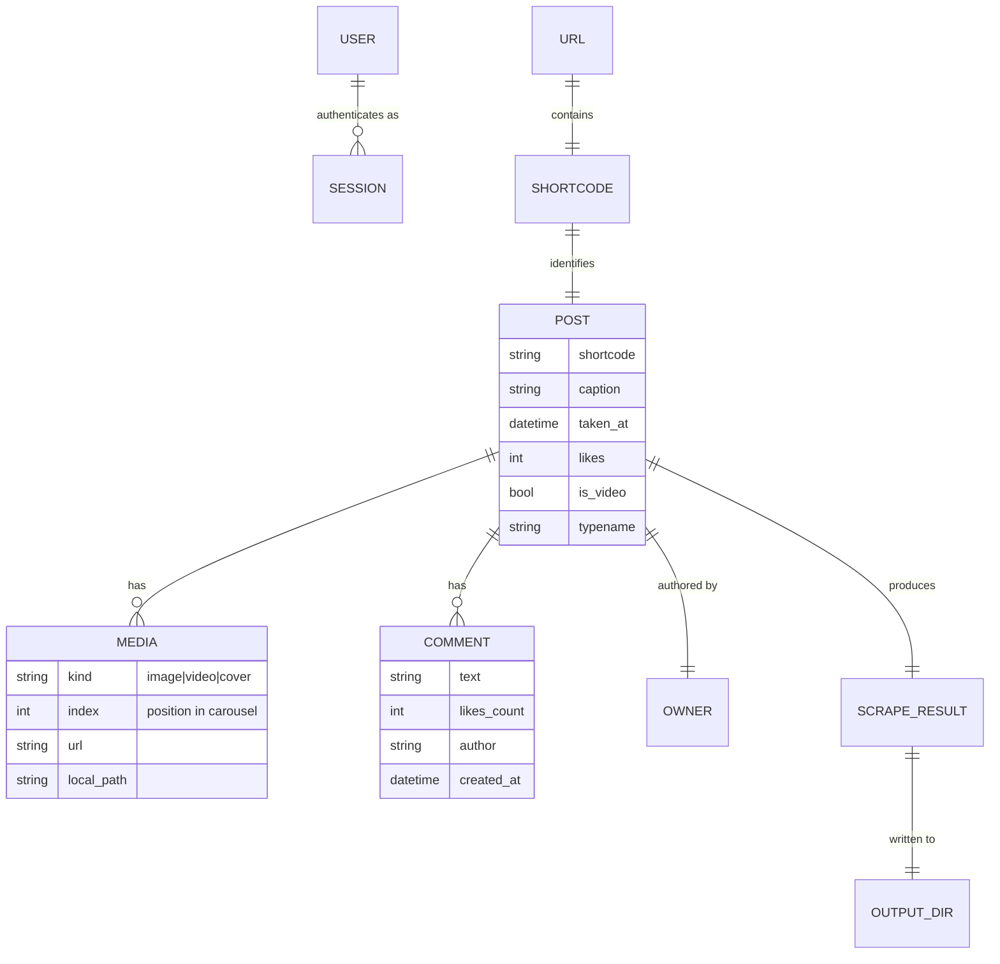
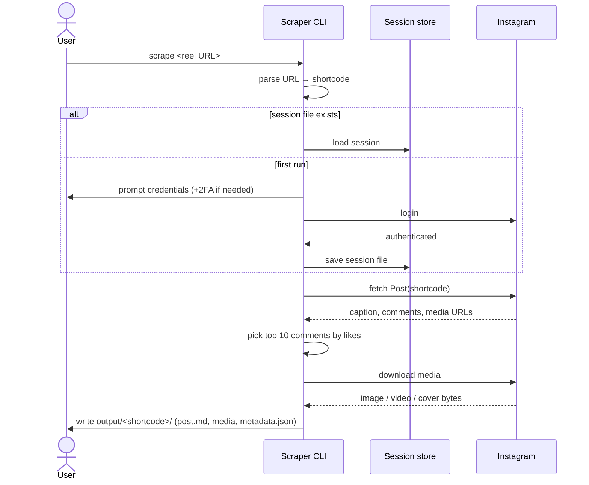

# Domain: Instagram Content & Scraping

This is the first change in the project, so it also establishes the core domain
vocabulary the rest of the system will build on.

## Core entities

## Glossary

| Term | Meaning |
|------|---------|
| **Post** | Any Instagram content item addressable by a shortcode — an image, a carousel, or a video/reel. In Instaloader everything is a `Post`. |
| **Reel** | A short vertical video. Addressed via `/reel/<shortcode>/`. Technically a `Post` with `is_video = true`; the `/reel/` and `/p/` paths resolve to the **same** shortcode space. |
| **Shortcode** | The short ID in the URL (e.g. `DXOCAyzEX8i` in `instagram.com/reel/DXOCAyzEX8i/`). The stable key we use to fetch a post and to name its output directory. |
| **Caption** | The post's main text body, written by the owner. |
| **Comment** | A viewer's text reply on the post. Has an author, a timestamp, and a like count. We ignore nested replies for now. |
| **Top 10 comments** | **Defined for this project as: the 10 comments with the highest `likes_count`**, ties broken by recency, taken from the set we scan. Instagram's internal "top" ranking is algorithmic, personalized, and **not** exposed — `get_comments()` returns latest-first, not UI-top order. So "top" here is a *constructed measurement*, not Instagram's ranking, and we say so in every `post.md`. |
| **Comment scan limit** | How many comments we iterate before ranking by likes (default ~200). A full scan (limit 0) gives an exact top-by-likes but costs many requests on popular posts, raising rate-limit risk. The chosen limit is recorded in the provenance header. |
| **Provenance / methods header** | A record, written into `metadata.json` (and summarized in `post.md`), of *how* this export was produced: fetch timestamp, tool + Instaloader version, account used, the comment-sort rule, and the scan depth. Makes the archive honest and reproducible. |
| **Carousel / album** | A post containing **multiple** media items (a mix of images and videos), navigated as a swipeable gallery (Instaloader's sidecar nodes). Instaloader's `download_post()` fetches every item automatically — we do not iterate nodes by hand. |
| **Media** | The downloadable binary assets of a post: each `image` and `video` item (a carousel has several, in post order), plus the `cover` (video poster frame). |
| **Owner** | The account that authored the post (username + id). |
| **Session** | An authenticated Instagram login state — a stored **cookie, not the password**. Created once via `interactive_login()`, serialized to a session file, then reused on later runs and **validated with `test_login()`** before being trusted. |
| **Credentials** | The user's own Instagram username + password, supplied via environment variable or interactive prompt — never committed. Optionally bypassed entirely by importing an existing **browser session** (`--load-cookies`). |
| **2FA / challenge** | Two-factor auth code or Instagram "suspicious login" challenge that may be required the first time a session is created. `interactive_login()` prompts for it inline. |
| **Rate limiting** | Instagram throttles or blocks clients that request too fast. We add deliberate delays and reuse sessions to stay under the radar. |
| **Output directory** | `output/<shortcode>/` — the self-contained folder holding `post.md`, media files, and `metadata.json`. |

## Actors & processes

## Key domain rules

- A **URL maps 1:1 to a shortcode**; the shortcode is the canonical identity and
  the output folder name. Re-scraping the same URL overwrites/refreshes that
  folder.
- **Reels and posts are the same kind of thing** under the hood — the tool must
  accept both `/p/` and `/reel/` (and the rare `/tv/`) paths.
- **A post may hold many media items.** Single image, single video/reel, or a
  carousel of several — the tool downloads **all** of them, preserving order.
- **Login is per-user and reusable.** We authenticate as the user; we do not
  attempt to access anything the user couldn't already see while logged in.
- **Comments visibility requires login.** Anonymous access cannot read comments
  reliably, which is the main reason credentials are mandatory rather than
  optional.
- **"Top" is likes-based and explicit**, not Instagram's hidden ranking, so the
  output is reproducible and explainable.
