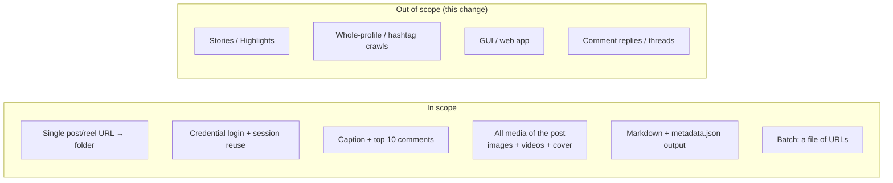

# Proposal: Initial Instagram Scraper

## What

A command-line tool that, given a single Instagram **post** or **reel** URL,
downloads everything we care about and writes it into a self-contained output
directory:

- The **media**: every image and video of the post (including all items of a
  carousel album), plus the cover image.
- The **caption** text.
- The **top 10 comments**.

The result for one URL is one directory. A single reel:

```
output/DXOCAyzEX8i/
├── post.md          # caption + top 10 comments, human-readable
├── DXOCAyzEX8i.mp4  # the reel video
├── DXOCAyzEX8i.jpg  # the video cover
└── metadata.json    # raw scraped fields (owner, date, likes, etc.)
```

A carousel album downloads every item (Instaloader names the first node by
shortcode, then `_1`, `_2`, … in post order):

```
output/DZ_KsKvKAW0/
├── post.md
├── DZ_KsKvKAW0.jpg     # carousel item 1 (image)
├── DZ_KsKvKAW0_1.mp4   # carousel item 2 (video)
├── DZ_KsKvKAW0_2.jpg   # carousel item 3 (image)
└── metadata.json
```

## Why

The user collects Instagram reels (see `SAMPLE_URLS.md`) and wants a durable,
offline, greppable archive of each one — the video, what it says, and what the
top commenters said — rather than relying on Instagram's app, which hides this
behind login walls and an ephemeral feed.

A scriptable tool turns a list of URLs into a folder of readable Markdown plus
media files that survive independently of Instagram.

## How (one paragraph)

Use **Python + [Instaloader](https://instaloader.github.io/)**. Instaloader is
purpose-built for this: it logs in with the user's credentials, persists the
session to a file (so we don't re-authenticate on every run and trip
Instagram's anti-bot defenses), resolves a post/reel **shortcode** from the URL,
and exposes the caption, comments, and media download URLs. We wrap it in a thin
CLI that handles the URL parsing, the "top 10 comments" selection, and the
Markdown rendering. Full technical detail in `architecture.md`.

## Scope



**In scope**

- Accept one Instagram post (`/p/<code>/`) or reel (`/reel/<code>/`) URL.
- Log in with user-provided credentials; persist and reuse the session.
- Download **all** media of the post — every image and video, including every
  item of a carousel album — plus the cover image.
- Extract the caption and the **top 10 comments** (ranked by like count).
- Write `post.md`, media files, and `metadata.json` — including a **provenance
  header** (fetch time, tool/library version, account, comment-sort rule and
  scan depth) — into `output/<shortcode>/`.
- Convenience: read a list of URLs from a file (e.g. `SAMPLE_URLS.md`) and
  process them in sequence with polite rate-limiting.

**Out of scope (for this change)**

- Stories, Highlights, IGTV-specific flows.
- Whole-profile, hashtag, or follower crawling.
- Any GUI or web service. The note mentions "sent from the app" — that
  integration is a later change; this delivers the core CLI engine it will call.
- Nested comment replies.

## Expected outcome

Running:

```bash
python -m insta_scraper https://www.instagram.com/reel/DXOCAyzEX8i/
```

produces `output/DXOCAyzEX8i/` with the video, cover image, a readable
`post.md`, and `metadata.json` — repeatably, without re-logging-in each time.

## Risks & open questions

- **Instagram anti-scraping**: aggressive rate limits and login challenges.
  Mitigated by session reuse (validated with `test_login()` before trusting a
  saved session), conservative delays, and clear error messages. This is the
  dominant operational risk.
- **Terms of Service**: automated collection is against Instagram's ToS. This is
  for the user's *personal* archival of content they can already view while
  logged in; the tool authenticates as the user and does not bypass access
  controls, CAPTCHAs, or rate limits. The official Graph API / OAuth path was
  considered (see `architecture.md`) but **cannot read arbitrary consumer
  reels**, so it does not fit this use case.
- **"Top 10 comments" is a measurement choice, not a neutral field.** Instagram's
  in-app "top" ranking is algorithmic and not exposed; `get_comments()` does not
  return that order. We define our ranking concretely as *the 10 comments with
  the highest like count among the comments scanned* (default first ~200; see
  `domain.md`), and we **state this rule explicitly in every `post.md`** so the
  export is honest about what "top" means.
- **EU / personal data**: the export contains commenters' usernames, text, and
  timestamps. For personal, unpublished archival we keep this lightweight: a
  provenance header records how and when data was collected, and the README
  carries a ToS / personal-use / GDPR note. Sharing or republishing the archive
  would raise further obligations and is out of scope.
- **2FA & challenges**: handled at session-creation time via Instaloader's
  `interactive_login()`, which prompts for password, 2FA code, or a security
  challenge as needed. Alternatively the user can import an existing browser
  session (`--load-cookies`) and skip password entry entirely.
