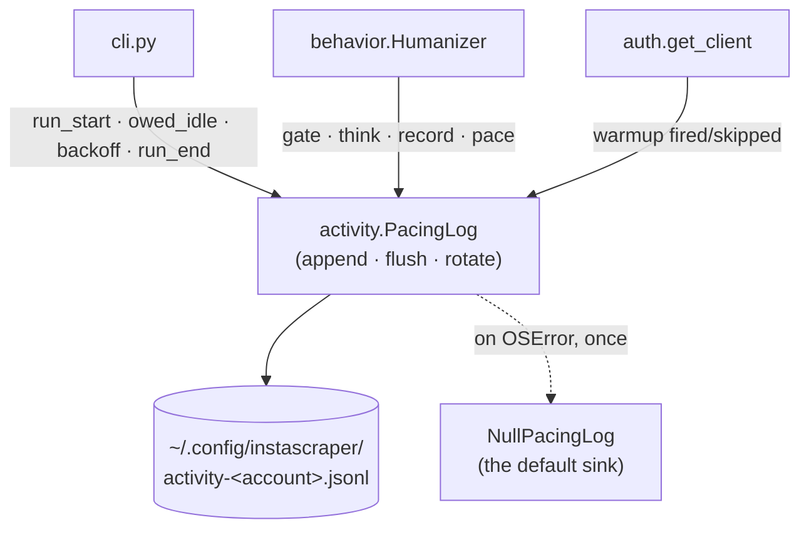

# Architecture: Pacing Log

> Read `proposal.md` (what & why) and `domain.md` (vocabulary) first, and
> `specs/changes/cross-session-humanization/architecture.md` for the `activity.py`
> module this extends and the events it makes possible.

## Overview

`activity.py` gains a second, unrelated-in-shape collaborator alongside the
`ActivityLedger`: the `PacingLog`. They share a module because they share a
directory, an account key, and a content ban — not because they share code.



| File | Change |
|------|--------|
| `activity.py` | `PacingLog` / `NullPacingLog` — append-only JSONL event trail with size rotation. The only file-touching code, as before. |
| `behavior.py` | `Humanizer(…, log=NullPacingLog())`; one `event()` per pacing decision. No file handles — the sink is injected. |
| `auth.py` | Each warm-up call site emits `warmup` with `fired` and a reason. |
| `cli.py` | Open the log for the run; `run_start` after the ledger loads, `owed_idle` around the wait, `backoff` from the `PleaseWaitFewMinutes` handler, `run_end` on every exit path; new flags. |
| `config.py` | `ENV_KEYS` entries for the three new parameters. |
| `README.md`, `specs/system/*` | Document the log, the cap, the `jq` one-liners, and that it is never read back. |

## Key decisions

### 1. Append-only history, in its own file

The ledger answers *where does the budget stand right now*. It cannot answer *what
happened over the last month*, because every field is overwritten in place. Two
jobs, two files, opposite write disciplines:

| | Activity ledger | Pacing log |
|---|---|---|
| Shape | one small mutable document | append-only event stream |
| Write | whole-file `os.replace` | `open(…, "a")` + one line + flush |
| Read by | the tool, every run | **you**, offline |
| Bounded by | the rolling window (pruned) | size rotation |
| Losing it costs | one run's continuity | analysis history only |
| Behavior depends on it | yes | **never** |

### 2. Format: JSON Lines

One object per line, so `tail`/`grep` work, `jq` works, and a truncated final line
(`kill -9` mid-write) costs one event rather than the file. A human-prose log would
read better and analyze worse; the point of this file is aggregation over weeks.

```jsonl
{"t":1770000000.12,"ev":"run_start","run":"a3f19c2e","cold_open":false,"gap":2.4,"owed":44.6,"sess_posts":7,"day_posts":31,"win":18}
{"t":1770000044.71,"ev":"owed_idle","run":"a3f19c2e","planned":44.6,"slept":44.6}
{"t":1770000044.72,"ev":"warmup","run":"a3f19c2e","fired":false,"why":"continuation"}
{"t":1770000044.73,"ev":"gate","run":"a3f19c2e","kind":"post","result":"PROCEED"}
{"t":1770000046.90,"ev":"think","run":"a3f19c2e","kind":"pre_fetch","slept":2.1}
{"t":1770000051.40,"ev":"record","run":"a3f19c2e","kind":"post","sess_posts":8,"day_posts":32,"win":19}
{"t":1770000051.41,"ev":"gate","run":"a3f19c2e","kind":"post","result":"STOP","why":"max_posts_per_day","limit":150}
{"t":1770000051.42,"ev":"run_end","run":"a3f19c2e","exit":1,"why":"graceful_stop","posts":1,"requests":6,"idle":46.7,"elapsed":51.3}
```

**Common envelope**: `t` (UTC epoch, from the injected clock), `ev`, and `run` — a
short random id minted per run and **injected**, so tests get a fixed one. Grouping
by `run` is what makes "ten invocations, one activity session" legible after the
fact.

### 3. Event catalog — every pacing decision, and nothing else

| `ev` | Emitted from | Payload |
|------|--------------|---------|
| `run_start` | `cli.main`, after the ledger opens | `cold_open`, `gap`, `owed`, session/day counters, window size |
| `owed_idle` | `cli.main`, before the first request | `planned`, `slept` (they differ if interrupted) |
| `warmup` | `auth.get_client` | `fired`, `why` (`cold_open` / `continuation` / `disabled`) |
| `gate` | `Humanizer.gate()` | `kind`, `result` (`PROCEED`/`WAIT`/`STOP`), `why` + `limit` when not `PROCEED`, `wait` for a `WAIT` |
| `think` | `Humanizer.think()` | `kind`, `slept` |
| `record` | `Humanizer.record()` | `kind`, resulting session/day counters, window size |
| `pace` | `Humanizer.pace_between_posts()` | `slept` |
| `backoff` | `cli.main`'s `PleaseWaitFewMinutes` handler | `attempt`, `slept` |
| `run_end` | `cli.main`, every exit path | `exit`, `why`, totals (`posts`, `requests`, `idle`, `elapsed`) |

`backoff` is the one that pays for the whole file: correlating Instagram's
rate-limit pushback against the pacing that preceded it is exactly the long-horizon
question the tool cannot currently answer, and a single run's stdout can never
answer it.

**What is never written**: URLs, shortcodes, media ids, captions, comment text,
commenter handles. Durations, counts, and closed-set enum reasons only. The account
appears in the filename, as it already does for the session file and the ledger.

### 4. Rotation: checked once, at open

Over `activity_log_max_bytes` (default 5 MB) → `os.replace` to `<name>.1` (one
previous generation kept, so ≤ 10 MB total). At the shape above — ~150 B/event, and
the `max_posts_per_day = 150` ceiling capping a heavy day near 1500 events — that is
roughly 50 days of history at the default; raise the flag for a longer horizon.
Checking per write would be a `stat` per event for no benefit: overshooting by one
run's events is harmless.

### 5. Failure is never fatal, and never observable

Any `OSError` on open or write warns **once**, swaps in `NullPacingLog` for the rest
of the run, and the run continues. A full disk must not cost you a scrape. This
mirrors the ledger's "state is a convenience" rule one step further: the log is not
even a convenience to the tool, only to you.

`NullPacingLog` is the no-op sink — the same pattern as `scraper.NullProgress`
(`specs/system/architecture.md` "Progress UI"). It is the default for
`Humanizer(log=…)`, so the library path and every existing test stay untouched, and
`behavior.py` keeps zero file handles.

### 6. Configuration — and why this one *is* persisted

Same precedence chain as everything else (**CLI > .env > env var > default**), with
defaults living in one place.

| Flag | `.env` key | Default |
|------|-----------|---------|
| `--no-activity-log` | `INSTASCRAPE_ACTIVITY_LOG` | on |
| `--activity-log-file PATH` | `INSTASCRAPE_ACTIVITY_LOG_FILE` | `~/.config/instascraper/activity-<account>.jsonl` |
| `--activity-log-max-bytes N` | `INSTASCRAPE_ACTIVITY_LOG_MAX_BYTES` | `5000000` |

**Unlike `--no-humanize` and `--no-activity-ledger`, `--no-activity-log` *is*
persisted.** Those two are in `cli._NEVER_SAVED` (`cli.py:410`) because they change
*behavior*, and default-on is the point of those features. The log changes no
behavior at all — opting out is a durable privacy preference, not a one-off, so it
saves like every other option.

## Testing strategy

Network-free and sleep-free, as established.

- Every emitted line parses as JSON and carries the `t`/`ev`/`run` envelope; an
  injected clock and `run_id` make the whole trail assertable byte-for-byte.
- The event sequence for a scripted run matches the expected order.
- `NullPacingLog` writes nothing and is the default.
- **Pacing is bit-identical with the log absent, working, and broken** — assert
  equal totals and equal sleep sequences across all three. This is the change's
  central claim, so it is the central test.
- A log whose writes raise `OSError` warns once and does not propagate.
- Rotation fires above the byte cap and keeps exactly one `.1` generation; the
  saved file is `0o600`.
- **Privacy guard**: scan every emitted payload for the fixture's shortcode, URL,
  caption, and commenter handle — none may appear. A scan, not a review, is what
  keeps this honest as events are added.

## Rejected alternatives

- **Keep the history inside the ledger** (an `events: [...]` array). Rejected — it
  turns a bounded document rewritten on every post into an unbounded one, so each
  flush rewrites the entire history and a crash mid-write risks the *state* to
  preserve the *log*. Opposite write disciplines belong in opposite files (§1).
- **A human-prose log** (`23:14 waited 45s — continuing session`). Rejected —
  nicer to read one line at a time, far worse at the actual job. Aggregating a
  month of pacing wants one parseable record per event; JSONL is still readable
  with `tail`, and `jq -r` renders prose on demand.
- **`logging` with a `RotatingFileHandler`.** Rejected — the repo has no logging
  configuration at all, and adopting one here would silently put the pacing trail
  at the mercy of root-logger config in library callers. A ~40-line append-and-
  rotate sink has no such coupling.
- **A separate `--activity-log` verbosity level.** Rejected as speculative — the
  event set is small and closed, and every event in it is one you want for the
  long-horizon questions. On or off is enough until proven otherwise.
- **Shipping it inside `cross-session-humanization`.** Rejected during that
  change's grilling: it was ~40% of that plan for a file nothing reads, and its
  most valuable events did not exist yet. Landing the ledger first also means the
  byte-cap arithmetic can be checked against a real event rate instead of a
  predicted one.
