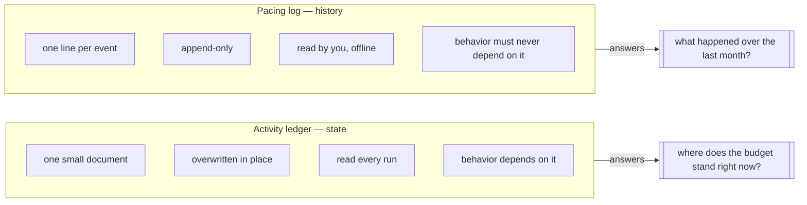

# Domain: Pacing Log

New vocabulary. Extends `specs/system/domain.md` and
`specs/changes/cross-session-humanization/domain.md`, whose **activity ledger** is
this change's opposite number: same directory, same account key, same content ban —
opposite write discipline.

## Glossary

| Term | Meaning |
|------|---------|
| **Pacing log** | The append-only JSONL trail at `~/.config/instascraper/activity-<account>.jsonl` (chmod 600), one line per **pacing event**. The **activity ledger**'s opposite: *history* rather than *state*, written once and never rewritten, size-rotated, and **never read by the tool**. Exists for offline analysis across weeks; safe to delete at any time. |
| **Pacing event** | One JSON object on one line: the `t`/`ev`/`run` envelope plus that event's numbers. Nine kinds, a closed set (`run_start`, `owed_idle`, `warmup`, `gate`, `think`, `record`, `pace`, `backoff`, `run_end`). Durations, counts, and enum reasons only — never a URL, shortcode, or comment. |
| **Run id** | A short random id minted once per invocation and stamped on every pacing event, so a month of interleaved runs can be grouped after the fact. Injected, so tests get a fixed value. |
| **Null sink** | The no-op `PacingLog` — the default, and what a broken log degrades to. Named because the point is that the *degraded* state is the normal state: `behavior.py` ships with a sink that writes nothing, so logging is purely additive. |
| **Write-only file** | A file the tool writes and never reads. Not a description of permissions but a **rule**: no code path may branch on the log's contents, which is what guarantees a corrupt or absent log cannot change a run. |

## Actors & key rules

- **History is the pacing log's job, and it is write-only.** State and history want
  opposite write disciplines, so they get opposite files. The ledger's content ban
  applies unchanged (no URLs, no shortcodes, no comments — decisions and durations),
  plus two rules of this file's own: **nothing in the tool ever reads it back**, so
  no behavior can come to depend on it; and it is **bounded** by a byte cap and
  rotation.
- **Observability must not be able to break a run.** A log that cannot be opened or
  written warns once and becomes a null sink. The pacing is identical with the log
  broken, working, or disabled — which is also how it is tested.
- **The account appears in the filename, never in the payload.** Same as the session
  file and the ledger. What is being paced is not a secret; *what was fetched*
  is not the log's business.
- **A log nobody reads is still worth writing, but only if it is free.** The whole
  justification is the questions in `proposal.md` that no single run's stdout can
  answer. That justification collapses the moment the log costs a run, a pacing
  decision, or unbounded disk — hence the three rules above rather than a
  general-purpose logging facility.
