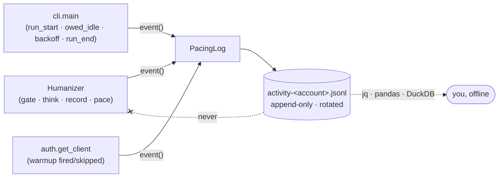

# Proposal: Pacing Log

> **Depends on `specs/changes/cross-session-humanization/`.** The events worth
> logging — owed idle, a skipped warm-up, a day ceiling binding — do not exist
> until that change lands. Split out of it deliberately: that change's thesis is
> *pacing state belongs to the account, not the process*; this one's is *we have no
> field evidence of our own cadence*. Separate theses, separate files, separate
> risk.

## Problem

The tool's pacing defaults are calibrated against
`specs/system/observations-web-cadence.md` — a dated capture of **someone else's**
session. We have never recorded our own. So three questions cannot be answered at
all, and they are exactly the ones that would tell us whether the defaults are
right:

- **Did the ceilings ever actually bind?** `max_requests_per_window = 200`,
  `max_posts_per_day = 150` — plausible numbers, never once observed in contact
  with reality. A ceiling that never fires is untested; a ceiling that fires every
  run is mis-set. We cannot currently tell which we have.
- **How much idle did a month of runs really spend?** Each run prints its own
  pacing to stdout and then that stdout is gone. The *distribution* over weeks —
  the thing a behavior profile actually describes — is unobservable.
- **What pacing preceded each `PleaseWaitFewMinutes`?** This is the only signal
  Instagram gives us about our own cadence, and we throw away the context needed
  to read it. `cli.with_backoff` (`cli.py:368`) waits it out and forgets.

The activity ledger cannot answer any of them, and not by oversight: it is *state*.
Every field is overwritten in place, so it can say where today's budget stands and
nothing about last month. History and state want opposite write disciplines.

## Proposed change

An append-only JSONL trail at `~/.config/instascraper/activity-<account>.jsonl`
(chmod 600, beside the ledger and the session file) — one line per pacing decision,
size-rotated, on by default, and **never read back by the tool**.

1. **`PacingLog` / `NullPacingLog`** in `activity.py` — append one JSON line per
   event and flush; rotate once at open above a byte cap. `NullPacingLog` is the
   default sink, the same no-op pattern as `scraper.NullProgress`, so `behavior.py`
   keeps zero file handles and the library path is untouched.
2. **Nine event kinds, a closed set**: `run_start`, `owed_idle`, `warmup`, `gate`,
   `think`, `record`, `pace`, `backoff`, `run_end`. Durations, counts, and enum
   reasons only.
3. **An injected run id** stamped on every event, so a month of interleaved runs
   can be grouped after the fact — and so tests can assert a whole trail
   byte-for-byte.
4. **Write-only, by rule.** Nothing in the tool reads the file. That is what lets
   it fail silently, be deleted at any moment, and never appear in a pacing
   decision.

## Scope

**In scope**

- `activity.py`: `PacingLog` / `NullPacingLog` — append, flush, chmod, rotate,
  degrade-to-null on `OSError`.
- `behavior.py`: one `event()` per pacing decision through the injected sink
  (`gate`, `think`, `record`, `pace`), preserving the module's no-I/O property.
- `auth.py`: `warmup` fired/skipped, with the reason.
- `cli.py`: open the log for the run; `run_start` after the ledger loads,
  `owed_idle` around the wait, `backoff` from the `PleaseWaitFewMinutes` handler,
  `run_end` on **every** exit path.
- Flags / `.env` keys for the path, the byte cap, and the opt-out, on the existing
  precedence chain.
- README (including a few `jq` one-liners) and `specs/system/*`.

**Out of scope**

- **Built-in analytics.** No `instascrape stats`, no report renderer, no querying.
  The format is JSONL precisely so `jq`, `pandas`, or DuckDB do that job better
  than we would. If a recurring question earns a subcommand later, that is its own
  change.
- **Feeding the log back into pacing.** Auto-tuning the profile from observed
  backoffs is a genuinely interesting follow-up and explicitly not this: the log
  stays write-only so it can never break a run.
- **Any change to a pacing decision.** The run must be bit-identical with the log
  working, broken, or disabled — that is a test, not an aspiration.
- **Structured logging generally.** This is one purpose-built sink, not a logging
  framework for the project.

## Expected outcome

- Every pacing decision across every run is on disk in one parseable file, so
  "did the ceilings bind?", "how much did we really idle in July?" and "what
  preceded that backoff?" become `jq` one-liners instead of guesses.
- `specs/system/observations-web-cadence.md` gains a companion source: our own
  cadence, so the next recalibration has field evidence from this tool rather than
  only a dated third-party capture.
- Pacing is provably unaffected — asserted by running the same scripted scenario
  with the log absent, working, and raising `OSError`.

## Risks & tradeoffs

- **A dated, months-long record of when you used the tool and how hard.** It
  carries no URLs, shortcodes, or content — but *when you were active* is itself
  sensitive. Hence chmod 600, a documented byte cap and rotation,
  `--no-activity-log` that saves like any other option, and README wording that it
  is safe to delete at any time because nothing reads it back.
- **An uncapped append-only file in `~/.config` would be a bug.** Bounding it is a
  real constraint, not a detail.
- **Observability that can break a run is worse than none.** Any `OSError` warns
  once and swaps in the null sink. A full disk must not cost you a scrape.
- **Log volume is a function of pacing, which the previous change just altered.**
  The byte-cap arithmetic assumes the post-ledger event rate; if that estimate is
  wrong the cap is wrong, and only the log itself can tell us.
