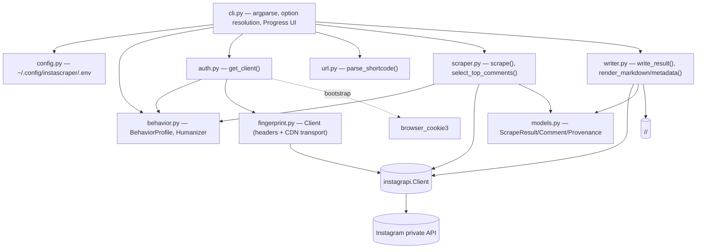
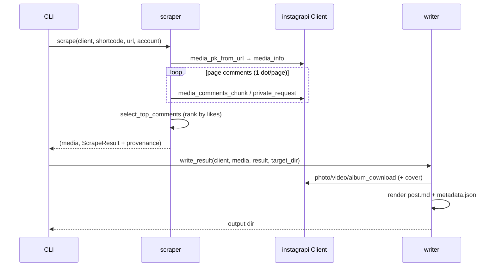
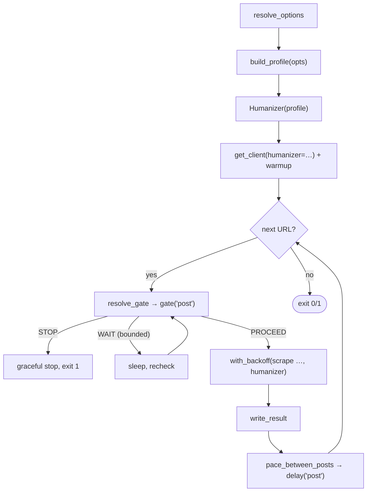

# System Architecture: instascrape

> Read `domain.md` for vocabulary.

## Tech & key decision

Python ≥ 3.10. The fetch/download backend is **[instagrapi](https://github.com/subzeroid/instagrapi)**
(Instagram's private mobile API), **not instaloader** — instaloader's web-GraphQL
post fetch returns empty data against current Instagram. Auth is a durable
**password login** with persisted session + stable device UUIDs; a logged-in
**browser-session import** (`browser_cookie3`) is an optional bootstrap.
Dependencies: `instagrapi`, `browser_cookie3`.

## Components

| Module | Responsibility |
|--------|----------------|
| `cli.py` | Parse args; resolve options (**CLI > .env > env var > default**); persist them; `Progress` UI; orchestrate auth → per-URL scrape → write; classify errors / exit codes. |
| `config.py` | Load/save the `.env` config (credentials + option defaults), chmod 600. |
| `behavior.py` | `BehaviorProfile` (all pacing policy, pure data) + `Humanizer` (applies it: think-time, early-stop, rate gating, backoff, warm-up) + `build_profile(opts)`. |
| `auth.py` | `get_client()`: reuse persisted session → else browser import → else password login (2FA/challenge handled); seeds the emulated device for **new** sessions only. |
| `fingerprint.py` | `Client` — an `instagrapi.Client` subclass that owns what a request *looks like*: drops instagrapi's forged per-user signed tokens, holds one `X-Pigeon-Session-Id` per run, echoes the `WWW-Claim` Instagram issues, and fetches media bytes as the app instead of `python-requests`. |
| `url.py` | `parse_shortcode()` for `/p/`, `/reel/`, `/tv/` URLs. |
| `scraper.py` | `scrape()` → fetch metadata + paged comments → `ScrapeResult`; `select_top_comments()` (pure). |
| `writer.py` | `write_result()` downloads all media + writes files; `render_markdown`/`render_metadata` (pure). |
| `models.py` | `ScrapeResult`, `Comment`, `Provenance` dataclasses (decoupling scraper from writer). |

## Authentication & session flow

- Session persisted to `~/.config/instascraper/session-<user>.json`; reuse needs
  no password and works non-interactively. Device UUIDs are kept stable across
  re-logins (the anti-flag measure).
- **Device identity is configuration, not randomization** (`auth.py:_apply_device`).
  `device_profile` (`android` default, `ios` available) seeds the emulated device
  **only when minting a new session**; a reused session is authoritative and is
  never re-fingerprinted — changing a live session's device is itself a
  new-device event. A mismatch logs a one-line notice and keeps the session; no
  speculative re-login ever happens. `android` is the coherent choice because
  instagrapi sends Android headers (`X-IG-Android-ID`, `X-IG-Capabilities`)
  regardless of the user-agent; `ios` changes the UA only and warns.
- `request_timeout = 15` on the client. `delay_range` comes from
  `BehaviorProfile.request_delay` (`auth._delay_range`), falling back to the old
  `[1, 3]` constant when unhumanized — per-request pacing stays single-sourced
  rather than double-sleeping around instagrapi's own delay.
- Optional `humanizer.warmup(client)` after a session load or fresh login makes
  a few benign app-open calls; a failure there never fails the run.

## Scrape & write flow (per URL)

- **Comment paging**: one request per page (mirrors instagrapi's own loop), one
  progress dot per page, honoring the scan limit (`0` = all). Under humanization
  each extra page costs `humanizer.delay("page")` and may be the last
  (`should_stop_early()`), and `0` is clamped to `scan_depth_clamp` (200) — paging
  every comment is one of the loudest bot signals there is.
- **Media**: `writer._download_media` writes all items into the shortcode folder
  from the URLs already on the `media` object (`*_download_by_url`), so no
  metadata is re-fetched; files renamed `<shortcode>[_n].<ext>`; a cover image is
  fetched for videos. `post.md` embeds images and links videos.
- **Private API only, both stages.** `scrape` uses `media_info_v1` and the writer
  uses the by-URL download helpers. instagrapi's convenience wrappers
  (`media_info`, `album_download`, `photo_download`, `video_download`) all fall
  back to web GraphQL — the path that doesn't work against current Instagram —
  which answers `200` with an HTML login wall and turns `MediaNotFound` or
  `LoginRequired` into an opaque `ClientJSONDecodeError`.

## Pacing (behavior.py)

All timing policy lives in one frozen dataclass; no call site holds a constant.
`Humanizer` applies it with an injected RNG and clock, which is what keeps the
test suite deterministic and sleep-free.

Defaults are **calibrated against a live capture of the real web client**, not
guessed: a genuine session fires a ~1.8 s burst of ~9 requests per action and
then idles **4.4 s → 22 s → 57 s** before the next one, and reads a screenful of
comments rather than all of them. Evidence, and what did *not* get modeled, in
`observations-web-cadence.md`.

- **Gate policy**: `WAIT` is only ever issued for the rolling-window ceiling, so
  it is bounded by `window_seconds`. Session/day ceilings and being outside
  `active_hours` return `STOP` — the tool never blocks for hours; it ends
  gracefully with `EXIT_PARTIAL`. `resolve_gate` sleeps through at most
  `_MAX_GATE_WAITS` waits so a stalled window can't spin forever.
- **`--delay` is not aliased onto `post_delay`** (`cli.pace_between_posts`).
  `resolve_options` fills `delay=3.0` unconditionally and `save_config` persists
  it, so it cannot signal user intent; mapping it onto the flagship 20–90 s idle
  would pin every upgrading user to 3 s. Humanized runs use `post_delay` only;
  `--delay` feeds the `--no-humanize` path. An explicitly passed `--delay` gets a
  notice (`cli.delay_flag_notice`), a stale `.env` value is ignored silently.
- **Backoff** (`cli.with_backoff`): `PleaseWaitFewMinutes` is waited out
  (`backoff_base * 2**attempt`, capped, jittered) rather than immediately fatal.
  `LoginRequired`/`ChallengeRequired` stay fatal — waiting won't help. Unhumanized
  runs re-raise on the first signal, exactly as before.
- **Scope**: we do *not* reshape request-level cadence into bursts (that lives
  inside instagrapi's per-endpoint fan-out). The win is at the higher level — the
  long, high-variance idle *between* logical actions, human-scale depth, and
  rate gating.

## Output

`<target-dir>/<shortcode>/`: `post.md` (provenance header + caption + embedded
media + top-10 comments), `metadata.json` (raw fields + `provenance`), and the
media files. The pure renderers make output testable without network.

## Wire identity (fingerprint.py)

`behavior.py` decides *when* a request is sent; `fingerprint.py` decides *what
it is*. The split matters because pacing cannot reach any of these: a request
presenting another account's signed tokens is identifiable however long you
waited. Four upstream leaks are closed (`fingerprint.py:48-77`):

| Leak | Upstream | Fix |
|---|---|---|
| Forged per-user tokens: `IG-U-SHBID`, `IG-U-SHBTS`, `IG-U-RUR`, `IG-U-IG-DIRECT-REGION-HINT` carry HMAC blobs **hardcoded in the library**, sent under *your* user id | `instagrapi/mixins/private.py:262-283` | dropped (`FORGED_HEADERS`); `IG-U-RUR` returns once Instagram issues a real one |
| `X-IG-Nav-Chain` constant claiming `self_profile → self_following` on every request, including cold media fetches | `mixins/private.py:257` | a deep-link chain matching the request (`NAV_CHAIN`, per-client settable) |
| `X-Pigeon-Session-Id` rebuilt every request — `base_headers` is a `@property` | `mixins/private.py:213` | one per `Client`, i.e. one per run (`pigeon_session_id`) |
| `X-IG-WWW-Claim: 0` forever; `x-ig-set-www-claim` is only read in the bloks flow, never in `private_request` | `mixins/bloks.py:697` | `_absorb_www_claim()` on every `private_request`, including failures |
| Media bytes leave as `python-requests/x.y` with no app headers, seconds after an "Instagram Android" call from the same IP | `mixins/photo.py:121`, `mixins/video.py:105` | `_download_to_path` / `_download_bytes` over `Client.cdn` with the app's user-agent |

Deliberately **not** addressed: the device/app-version/bloks triple in
`instagrapi/config.py:15-31` is identical for every user of the library, but
rotating it on a live session is itself the new-device event `auth.py` avoids —
so it stays device identity's business, minted once and never touched.

## Cross-cutting

- **Errors**: not-found/private → skip; transient (timeouts) → skip & continue;
  `PleaseWaitFewMinutes` → backoff-and-retry under humanization, fatal once the
  attempts are spent; auth (`LoginRequired`, `ChallengeRequired`) → fatal stop.
  A rate ceiling or the active-hours window → graceful stop with exit 1. Exit
  codes 0/1/2.
- **Library use**: `get_client`, `parse_shortcode`, `scrape`, `write_result`,
  renderers, and models are importable (see README "Use as a library").
- **Secrets**: credentials + session live under `~/.config/instascraper/`;
  `output/`, `data/`, `.env`, `session-*.json` are git-ignored.
- **Tests**: network-free **and sleep-free** suite (URL parsing, comment ranking
  + paging, rendering, config, option resolution, progress, auth helpers,
  behavior profile/humanizer). Anything timing-related injects a seeded
  `random.Random`, a recording `sleep`, and fake `now`/`wall` clocks.
