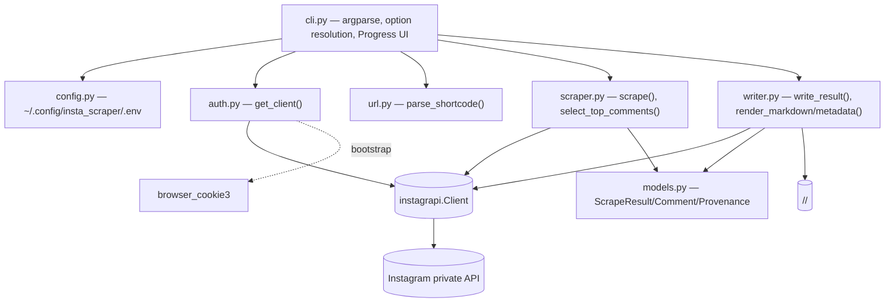
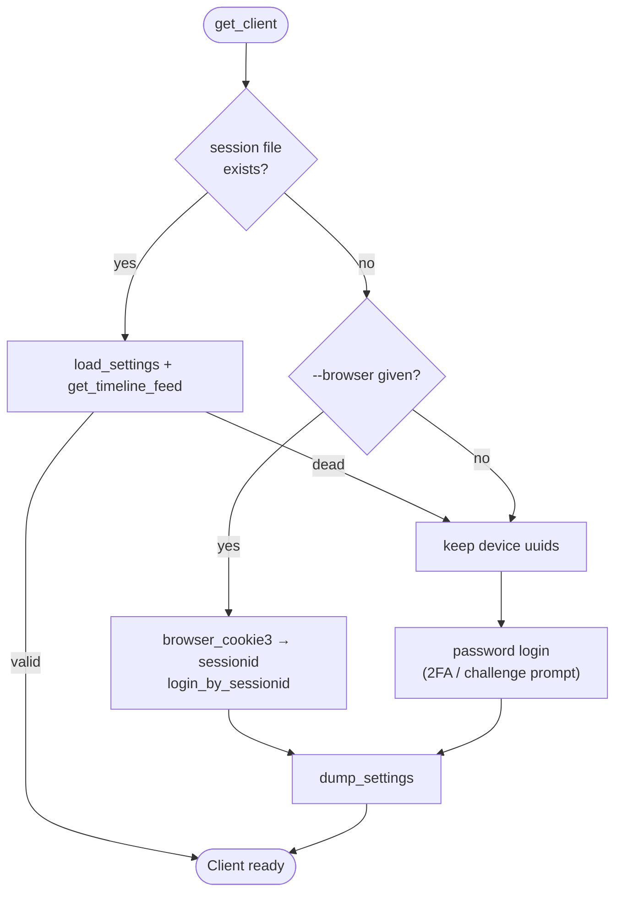
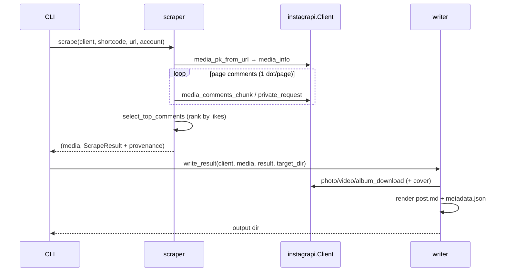

# System Architecture: instascrape

> Read `domain.md` for vocabulary.

## Tech & key decision

Python ≥ 3.10. The fetch/download backend is **[instagrapi](https://github.com/subzeroid/instagrapi)**
(Instagram's private mobile API), **not instaloader** — instaloader's web-GraphQL
post fetch returns empty data against current Instagram. Auth is a durable
**password login** with persisted session + stable device UUIDs; a logged-in
**browser-session import** (`browser_cookie3`) is an optional bootstrap.
Dependencies: `instagrapi`, `browser_cookie3`.

## Components

| Module | Responsibility |
|--------|----------------|
| `cli.py` | Parse args; resolve options (**CLI > .env > env var > default**); persist them; `Progress` UI; orchestrate auth → per-URL scrape → write; classify errors / exit codes. |
| `config.py` | Load/save the `.env` config (credentials + option defaults), chmod 600. |
| `auth.py` | `get_client()`: reuse persisted session → else browser import → else password login (2FA/challenge handled). |
| `url.py` | `parse_shortcode()` for `/p/`, `/reel/`, `/tv/` URLs. |
| `scraper.py` | `scrape()` → fetch metadata + paged comments → `ScrapeResult`; `select_top_comments()` (pure). |
| `writer.py` | `write_result()` downloads all media + writes files; `render_markdown`/`render_metadata` (pure). |
| `models.py` | `ScrapeResult`, `Comment`, `Provenance` dataclasses (decoupling scraper from writer). |

## Authentication & session flow

- Session persisted to `~/.config/insta_scraper/session-<user>.json`; reuse needs
  no password and works non-interactively. Device UUIDs are kept stable across
  re-logins (the anti-flag measure).
- `delay_range = [1, 3]` and `request_timeout = 15` on the client; the CLI also
  paces `--delay` seconds between posts in batch mode.

## Scrape & write flow (per URL)

- **Comment paging**: one request per page (mirrors instagrapi's own loop), one
  progress dot per page, honoring the scan limit (`0` = all).
- **Media**: `album/video/photo_download` writes all items into the shortcode
  folder; files renamed `<shortcode>[_n].<ext>`; a cover image is fetched for
  videos. `post.md` embeds images and links videos.

## Output

`<target-dir>/<shortcode>/`: `post.md` (provenance header + caption + embedded
media + top-10 comments), `metadata.json` (raw fields + `provenance`), and the
media files. The pure renderers make output testable without network.

## Cross-cutting

- **Errors**: not-found/private → skip; transient (timeouts) → skip & continue;
  auth/rate-limit (`LoginRequired`, `PleaseWaitFewMinutes`) → fatal stop. Exit
  codes 0/1/2.
- **Library use**: `get_client`, `parse_shortcode`, `scrape`, `write_result`,
  renderers, and models are importable (see README "Use as a library").
- **Secrets**: credentials + session live under `~/.config/insta_scraper/`;
  `output/`, `data/`, `.env`, `session-*.json` are git-ignored.
- **Tests**: network-free suite (URL parsing, comment ranking + paging,
  rendering, config, option resolution, progress, auth helpers).
