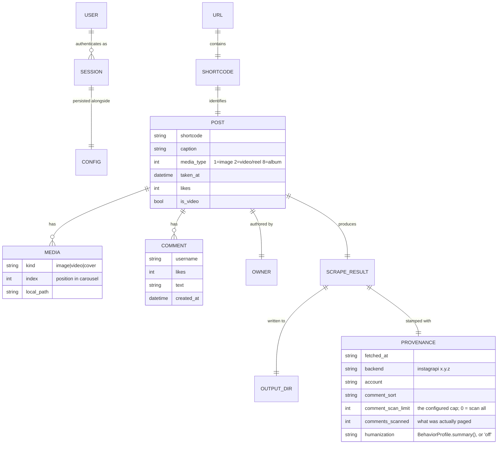

# System Domain: instascrape

`instascrape` archives an Instagram **post** or **reel** to a local folder —
media, caption, and the top 10 comments — for personal, offline keeping.

## Core entities

## Glossary

| Term | Meaning |
|------|---------|
| **Post / Reel** | An Instagram content item addressable by a shortcode. A reel is a `media_type == 2` (video) post; `/p/`, `/reel/`, `/tv/` URLs all resolve to the same shortcode space. |
| **Shortcode** | The short id in the URL (e.g. `DXOCAyzEX8i`). Canonical identity; names the output folder. |
| **Carousel / album** | A `media_type == 8` post with multiple media items (images and/or videos). All items are downloaded, numbered `_1`, `_2`, … |
| **Caption** | The post's main text, written by the owner. |
| **Comment** | A viewer's reply: username, text, like count, timestamp. Nested replies are out of scope. |
| **Top 10 comments** | A **constructed ranking** — the 10 comments with the highest like count among the ones *actually scanned*. **Not** Instagram's opaque in-app "top" order. Alternative mode `instagram` = first returned (latest-first). |
| **Comment scan limit** | How many comments to page through before ranking (default 200; `0` = all, clamped to a human-scale depth under humanization). Recorded in provenance alongside `comments_scanned`, the count really paged — early give-up makes the two differ, and the ranking is over the real set. |
| **Media** | Downloaded binary assets: image(s), video(s), and a video cover image. |
| **Owner** | The account that authored the post. |
| **Session** | A persisted, authenticated **instagrapi** login (mobile auth + stable device UUIDs), stored as `session-<user>.json`. Reused across runs; re-login only when it dies. |
| **Credentials** | The user's Instagram username + password. Needed only for the first login; afterwards the session is reused. Persisted (chmod 600) in the config `.env`. |
| **2FA / challenge** | A verification code (email/SMS) Instagram may require on a fresh login; prompted for interactively. |
| **Provenance / methods header** | A record of how an export was made (fetch time, backend + version, account, comment-sort rule, configured scan limit, comments actually scanned, and the pacing it ran under), written into `post.md` and `metadata.json`. |
| **Behavior profile** | The single, fully parameterized model of human-like usage: every delay range, pause probability, depth clamp, rate ceiling, and active-hours window. Loaded via the usual precedence chain; no timing constant lives at a call site. |
| **Humanizer** | The runtime object that *applies* a behavior profile — samples a think-time for an action, decides probabilistic early-stops, enforces rate ceilings, computes backoff. Holds a seedable RNG and an injectable clock, so behavior is deterministic and sleep-free under test. |
| **Think-time / action kind** | The pause a human takes between two actions, sampled per *kind*: `request`, `page`, `post`, `read_pause`, `warmup`. Each kind has its own range; an occasional **long pause** adds the tail that even spacing never produces. |
| **Early give-up** | Stopping comment paging with a configured per-page probability, so depth varies post to post instead of always hitting the same count — a human reads a screenful and moves on. |
| **Rate ceiling** | A cap on activity: requests/posts per **session** and requests per **rolling window**. The window cap yields a bounded `WAIT`; a session cap ends the run gracefully (`STOP`). |
| **Active-hours window** | Local hours during which automated activity is plausible (default 08:00–23:00), with jittered edges. Outside it the run **stops gracefully** rather than blocking for hours until the window opens. |
| **Gate result** | The verdict before an action: `PROCEED`, `WAIT(seconds)` (bounded, rolling-window only), or `STOP` (session ceiling, or outside active hours). |
| **Device profile** | Which device family is emulated (`android` default, `ios` available). **Stable, not sampled** — seeded once when a session is minted and never applied to a reused session, since re-fingerprinting a live session is itself a new-device event. |
| **Politeness backoff** | Jittered exponential wait after a rate-limit signal — behaving like a human who simply waits — instead of an immediate fatal stop. |
| **Humanization toggle** | `--no-humanize`: run in the old fast, unhumanized mode when the user accepts the detection risk. Humanization is on by default. |
| **Config** | Persisted credentials + option defaults at `~/.config/instascraper/.env`. |
| **Output directory** | `<target-dir>/<shortcode>/` holding `post.md`, media files, and `metadata.json`. |

## Actors & key rules

- **The user** authenticates as themselves and archives content they can already
  see while logged in. Personal-use only; automated collection violates
  Instagram's ToS, and exports contain other people's personal data.
- **A URL maps 1:1 to a shortcode**, which is the output folder name; re-scraping
  refreshes that folder.
- **Login is durable and reused.** First run needs credentials; the session is
  persisted with a stable device id so Instagram is not presented a "new device"
  every run (which gets flagged).
- **"Top" is explicit and honest** — likes-based among the set that was really
  scanned, stated in every `post.md` along with that count, never claimed to
  equal Instagram's in-app ranking.
- **One source of truth for timing.** Every delay, probability, ceiling, and
  window lives in the behavior profile; a reviewer reads one dataclass and knows
  every way the tool paces itself. Timings are **sampled ranges, never fixed**.
- **Identity is stable, behavior is varied.** The device and session must not
  drift; the pacing must not repeat. These pull in opposite directions on
  purpose.
- **Honest limits.** Behavioral realism lowers, but cannot eliminate, detection
  risk; account history and IP reputation also matter and are outside the tool's
  control.
