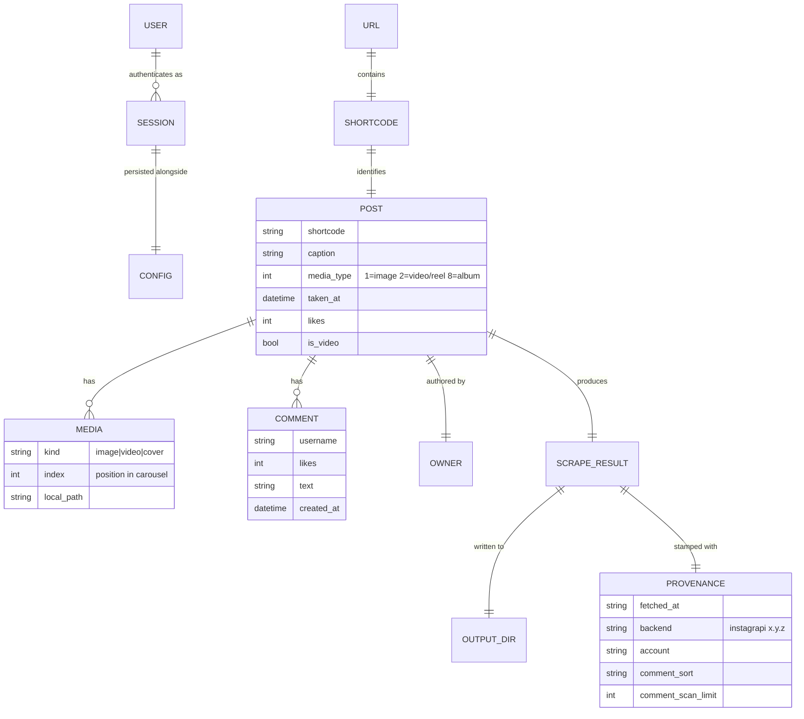

# System Domain: instascrape

`instascrape` archives an Instagram **post** or **reel** to a local folder —
media, caption, and the top 10 comments — for personal, offline keeping.

## Core entities

## Glossary

| Term | Meaning |
|------|---------|
| **Post / Reel** | An Instagram content item addressable by a shortcode. A reel is a `media_type == 2` (video) post; `/p/`, `/reel/`, `/tv/` URLs all resolve to the same shortcode space. |
| **Shortcode** | The short id in the URL (e.g. `DXOCAyzEX8i`). Canonical identity; names the output folder. |
| **Carousel / album** | A `media_type == 8` post with multiple media items (images and/or videos). All items are downloaded, numbered `_1`, `_2`, … |
| **Caption** | The post's main text, written by the owner. |
| **Comment** | A viewer's reply: username, text, like count, timestamp. Nested replies are out of scope. |
| **Top 10 comments** | A **constructed ranking** — the 10 comments with the highest like count among the first *scan-limit* scanned. **Not** Instagram's opaque in-app "top" order. Alternative mode `instagram` = first returned (latest-first). |
| **Comment scan limit** | How many comments to page through before ranking (default 200; `0` = all). Recorded in provenance. |
| **Media** | Downloaded binary assets: image(s), video(s), and a video cover image. |
| **Owner** | The account that authored the post. |
| **Session** | A persisted, authenticated **instagrapi** login (mobile auth + stable device UUIDs), stored as `session-<user>.json`. Reused across runs; re-login only when it dies. |
| **Credentials** | The user's Instagram username + password. Needed only for the first login; afterwards the session is reused. Persisted (chmod 600) in the config `.env`. |
| **2FA / challenge** | A verification code (email/SMS) Instagram may require on a fresh login; prompted for interactively. |
| **Provenance / methods header** | A record of how an export was made (fetch time, backend + version, account, comment-sort rule, scan depth), written into `post.md` and `metadata.json`. |
| **Config** | Persisted credentials + option defaults at `~/.config/instascraper/.env`. |
| **Output directory** | `<target-dir>/<shortcode>/` holding `post.md`, media files, and `metadata.json`. |

## Actors & key rules

- **The user** authenticates as themselves and archives content they can already
  see while logged in. Personal-use only; automated collection violates
  Instagram's ToS, and exports contain other people's personal data.
- **A URL maps 1:1 to a shortcode**, which is the output folder name; re-scraping
  refreshes that folder.
- **Login is durable and reused.** First run needs credentials; the session is
  persisted with a stable device id so Instagram is not presented a "new device"
  every run (which gets flagged).
- **"Top" is explicit and honest** — likes-based among a scanned set, stated in
  every `post.md`, never claimed to equal Instagram's in-app ranking.
