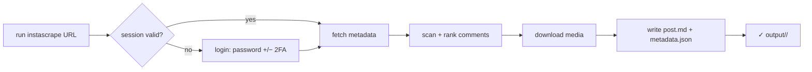

# System Functional Description: instascrape

What the tool does, from a user's point of view.

## Capabilities

- **Archive one URL**: `instascrape "<post/reel/tv URL>"` → a folder with media,
  caption, and top-10 comments.
- **Batch a file of URLs**: `--file <path>` scrapes every Instagram URL found in
  a text/markdown file, paced between posts.
- **All media**: single image, reel video (+ cover), or every item of a carousel.
- **Comment ranking**: top 10 by like count (`--comment-sort likes`, default) or
  first-returned (`--comment-sort instagram`); depth via `--comment-scan-limit`.
- **Durable login**: log in once (password, with 2FA/challenge); reused after,
  with a stable emulated device that is never silently re-fingerprinted.
- **Humanized pacing (on by default)**: sampled think-time between requests,
  pages, and posts; human-scale comment depth; per-session and per-hour rate
  ceilings; an active-hours window; and a polite wait-and-retry after a
  rate-limit signal. Every parameter is a `--humanize-*` flag; `--no-humanize`
  restores the old fast behavior.
- **Remembered settings**: credentials + options saved to `.env` and reused.
- **Live progress**: each step announces itself and completes on the same line;
  comment scanning shows one dot per page fetched.

## Primary user journey

## Inputs

| Input | Where | Notes |
|-------|-------|-------|
| Post/reel URL or `--file` | CLI (one required) | the work to do |
| `--username` / `--password` | CLI / `.env` / env | first login only; then saved & reused |
| `--target-dir` (`--output`) | CLI / `.env` | output base; default `output` |
| `--browser` | CLI | bootstrap login from a logged-in browser |
| `--session-file` | CLI / `.env` | override session location |
| `--device-profile` | CLI / `.env` | device family for a **new** session (`android` default) |
| `--delay` | CLI / `.env` | seconds between posts — **only with `--no-humanize`** |
| `--comment-sort`, `--comment-scan-limit` | CLI / `.env` | ranking rule + depth |
| `--no-humanize`, `--humanize-*` | CLI / `.env` | pacing policy; defaults in `behavior.BehaviorProfile` |
| `--no-save-config` | CLI | don't persist options/credentials |

Resolution precedence: **CLI flag > saved `.env` > environment variable >
built-in default**. `instascrape -h` documents everything. Humanization options
are left unset unless chosen, so `BehaviorProfile` stays the single source of
default truth and unused keys stay out of the saved `.env`.

Two deliberate exceptions to "options are remembered":

- **`--no-humanize` is never persisted** (`cli._NEVER_SAVED`). Humanization being
  the default is the point of the feature; a one-off opt-out silently leaking
  into every later run would defeat it. It applies per run, and is announced on
  stderr each time. A permanent opt-out requires a hand-written
  `INSTASCRAPE_HUMANIZE=false`, which `--humanize` overrides.
- **Rate state is per process, not persisted.** Session/window counters live in
  the one `Humanizer` a run creates, so *N* separate invocations do not share a
  budget and a one-URL run has no inter-post idle at all. Batch with `--file`
  rather than looping the command — see README "Prefer one batch over many runs".

## Outputs

- `<target-dir>/<shortcode>/post.md` — provenance header (including how many
  comments were actually scanned and the pacing used), caption, embedded
  `## Media`, and `## Top N comments`.
- `<target-dir>/<shortcode>/metadata.json` — raw fields + `provenance` block.
- The media files (`<shortcode>[_n].<ext>`, plus a `.jpg` cover for videos).

Exit codes: `0` all good · `1` some items skipped (not found / private /
transient), **or the run ended gracefully** at a rate ceiling or outside the
active-hours window · `2` fatal (auth failed / rate-limited past the backoff
attempts — stopped early).

## Out of scope

Stories/Highlights, whole-profile or hashtag crawls, nested comment replies, any
GUI. Sharing/republishing exports raises data-protection obligations and is the
user's responsibility (personal-archive tool).
