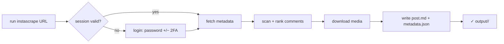

# System Functional Description: instascrape

What the tool does, from a user's point of view.

## Capabilities

- **Archive one URL**: `instascrape "<post/reel/tv URL>"` → a folder with media,
  caption, and top-10 comments.
- **Batch a file of URLs**: `--file <path>` scrapes every Instagram URL found in
  a text/markdown file, paced between posts.
- **All media**: single image, reel video (+ cover), or every item of a carousel.
- **Comment ranking**: top 10 by like count (`--comment-sort likes`, default) or
  first-returned (`--comment-sort instagram`); depth via `--comment-scan-limit`.
- **Durable login**: log in once (password, with 2FA/challenge); reused after.
- **Remembered settings**: credentials + options saved to `.env` and reused.
- **Live progress**: each step announces itself and completes on the same line;
  comment scanning shows one dot per page fetched.

## Primary user journey

## Inputs

| Input | Where | Notes |
|-------|-------|-------|
| Post/reel URL or `--file` | CLI (one required) | the work to do |
| `--username` / `--password` | CLI / `.env` / env | first login only; then saved & reused |
| `--target-dir` (`--output`) | CLI / `.env` | output base; default `output` |
| `--browser` | CLI | bootstrap login from a logged-in browser |
| `--session-file` | CLI / `.env` | override session location |
| `--delay` | CLI / `.env` | seconds between posts (batch) |
| `--comment-sort`, `--comment-scan-limit` | CLI / `.env` | ranking rule + depth |
| `--no-save-config` | CLI | don't persist options/credentials |

Resolution precedence: **CLI flag > saved `.env` > environment variable >
built-in default**. `instascrape -h` documents everything.

## Outputs

- `<target-dir>/<shortcode>/post.md` — provenance header, caption, embedded
  `## Media`, and `## Top N comments`.
- `<target-dir>/<shortcode>/metadata.json` — raw fields + `provenance` block.
- The media files (`<shortcode>[_n].<ext>`, plus a `.jpg` cover for videos).

Exit codes: `0` all good · `1` some items skipped (not found / private /
transient) · `2` fatal (auth failed / rate-limited — stopped early).

## Out of scope

Stories/Highlights, whole-profile or hashtag crawls, nested comment replies, any
GUI. Sharing/republishing exports raises data-protection obligations and is the
user's responsibility (personal-archive tool).
